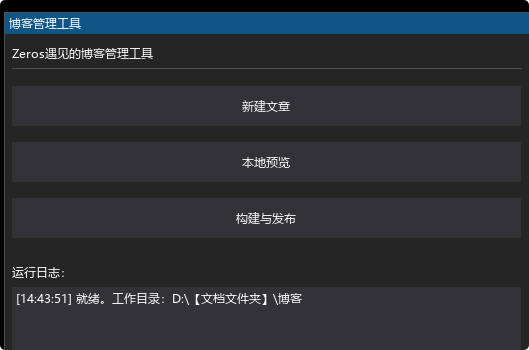
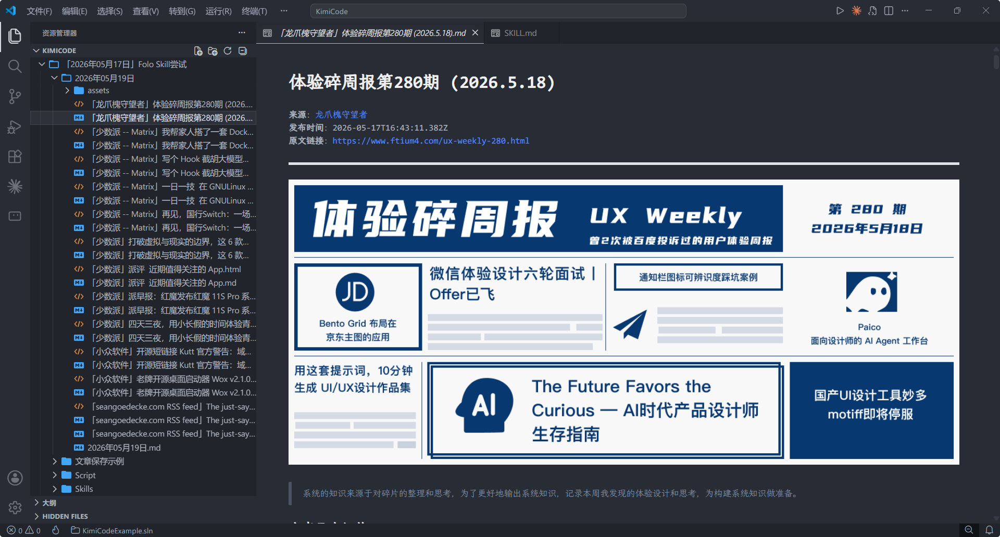
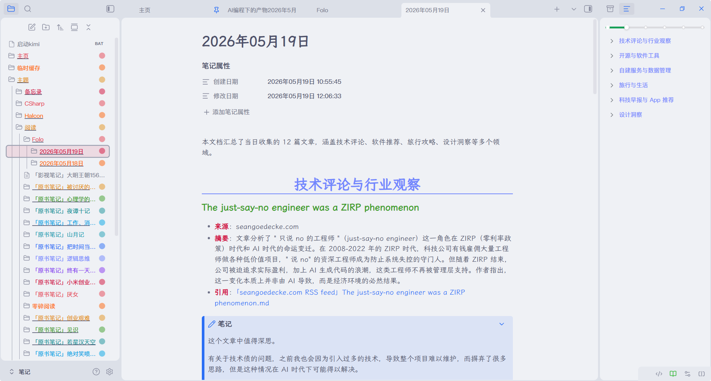
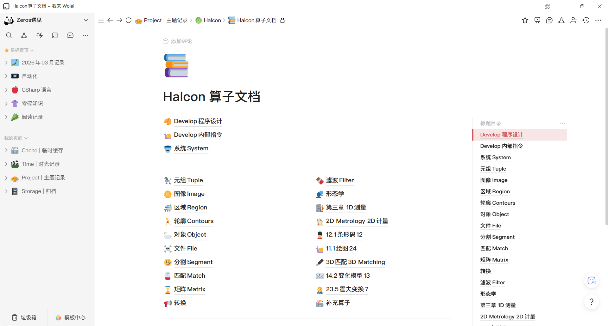
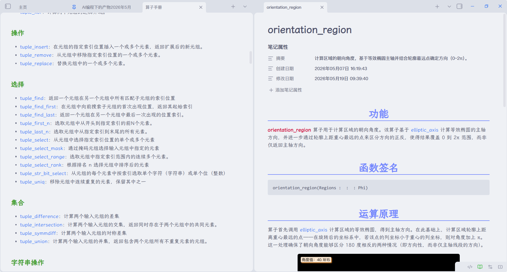
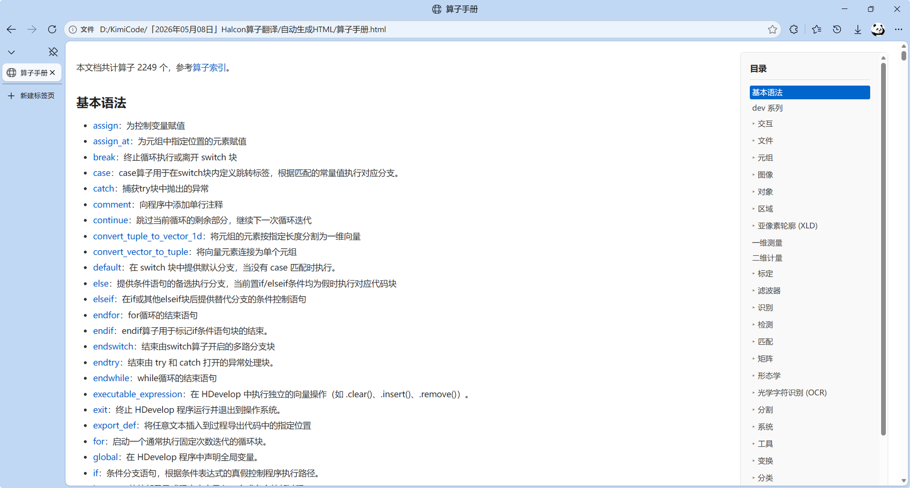
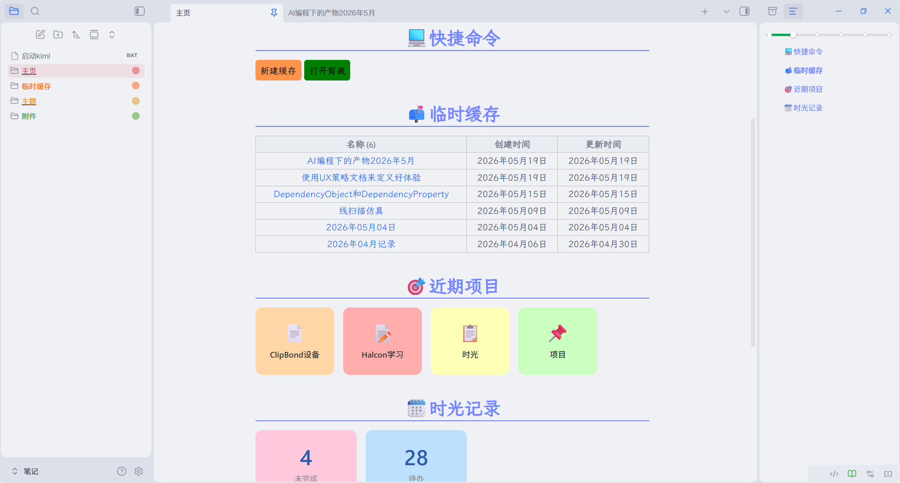
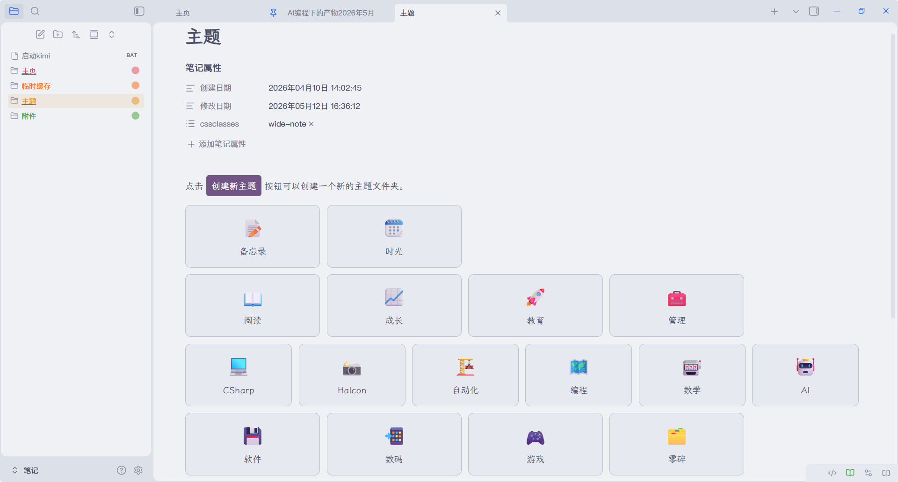
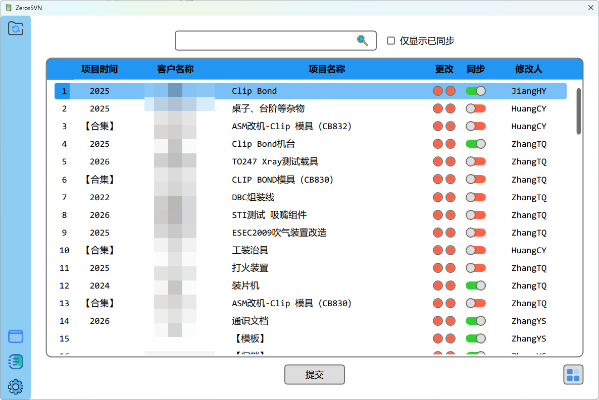
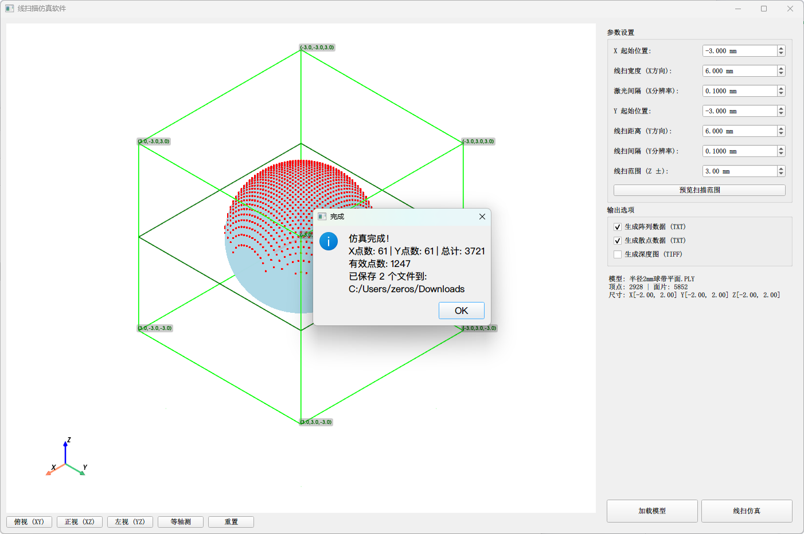

这篇文章记录是，是最近我使用 AI 编程实现的几个软件，用于解决我平时遇到的问题。

或许你也有过，做一件事情的时候脑子里会思考，有些地方不对，太繁琐了。但是又因为学习成本太高或者精力不足，使得自己很难改变什么。

在 AI 时代下，我开始意识到 AI 的价值正是帮助实现心里的想法。

## 博客发布

近期由于本地 AI Agent 的爆火，我将我的笔记系统从 wolai 导出到了 Obsidian 中了。粗略的算了一下，自从我 2018 年开始养成记录的习惯后，前后写了 4000 多篇笔记了。

我的博客是去年才搭建的，但是更新频率并不多。其中一条原因是我将博客视作一个发布界面，并非每条笔记我都要发布出来。另一个很现实的原因是，我使用 hugo 编译静态网站，但是太难用了。

基于这个原因，我使用 KimiCode 做了一个辅助博客发布的软件。

这个软件有三个功能：
1. 新建文章
2. 本地预览文章
3. 构建并发布博客

希望我能使用这个工具，帮助我增加更新博客的频率。

## 每日阅读

过去我一直使用 Folo 这个软件，订阅我常看的网站、博客，并且我会在笔记系统中记录我认为有价值的文章，并反复阅读。这就导致了一个问题：有一些过去我没有记录的内容，之后就如泥牛入海，再也找不到了。

受到最近爆火的卡帕西的知识库的启发，以及最近 Folo 发布了自己 cli，我做了一个脚本，用于将我在 Folo 下的未读文章以 Markdown 的格式保存到本地。

简单来说，首先使用 Folo 的 cli 获取未读文章的原始网络地址，然后根据原始网络地址对应的网站保存为本地的 html，最后根据 html 的来源使用不同的策略解析成对应的 markdown 文件。这些步骤我都使用 KimiCode 实现了一个 Python 脚本来运行。

我会使用 KimiCode 去总结当天的 markdown 文件，告诉这些文章大概讲了什么内容，遇到我感兴趣的内容，再去读原文。最重要的是，做完这些后，我会按天将整个文件夹放在 Obsidian 中进行存档。这样在我后面想起来一篇文章但是找不到时，我就可以让 AI 去这个文件夹下寻找。

## 文档翻译

Halcon 我在工作中经常会使用到的软件，功能十分强大，唯一的缺点是，文档和手册都是英文的，看起来太痛苦了。

之前学习的时候，搭配翻译软件也能看个七七八八，但是过了一段时间之后，记忆会逐渐淡忘。为此我在 wolai 中曾经做过一个汉化的库。

很遗憾的是，后来我意识到这件事太困难，并且效率太低了。

现在 AI 的大环境下，我使用 ClaudeCode + DeepSeek 实现了 Halcon 本地算子的翻译，并将其放在了 Obsidian 中。

这样做有两点好处：
1. 所有的内容都是基于本地的 html 文档翻译过来的，真实性有了保证
2. 转换成 markdown 之后，对于文档里我认为不足的地方可以直接修改

除此以外，为了让我的同事们都可以用上中文的 Halcon 手册，我又回过头来将其编译成了 html。因为我的同事们并不使用 Obsidian，因此直接将 markdown 发给他们，还得下载 Obsidian 并且要保持和我的配置类似。为了简单一点，直接编译成 html，使用浏览器打开更简单一点。

## Obsidian 插件

正如我上面所说，我将笔记系统从 wolai 迁移到了 Obsidian 中。

我好多年前就知道了 Obsidian 这个软件，但是因为其个性化能力太强，需要频繁的折腾和学习，我担心会影响我记笔记的积极性，最终还是选择了开箱即用的 wolai。

但是在 AI 时代下，wolai 出现了致命缺陷——数据存在服务器上，我没法喂给 AI 使用。在经过了几天的纠结之后，我还是选择了放弃 wolai，使用 Obsidian。

Obsidian 最强大的地方在于他的插件社区，虽然这也是我当初放弃的原因，因为插件太多了，每一个插件都要去学习，尤其是 Templater、DataView、Button 这几个插件，不但配置复杂，还要去学习 JS 语法。

但是现在有了 AI，完全不需要去学了。我直接将这些插件的官方文档喂给 AI 做成了 Skill，然后使用这个 Skill 去实现我想要的功能，简单易用，并且自由度很高。

## 工作上的小软件

AI 在我工作上的帮助就更多了，也正是由于很多，所以这几只能挑几个进行说明。

我使用 AI 优化了 ZerosSVN 软件，现在这个软件使用更简单了，一键即可实现同步、提交、冲突解决等所有步骤。

我用 AI 做了一个线扫描的仿真软件，加载对应的产品模型，就可以获得线扫描数据。这可以帮助我在测试软件时，提供一些数据。

## 总结

这几个软件没有一个是需要大量的学习才能做出来的，全都是我遇到了实际问题，然后去思考该如何解决问题，最后使用 AI 大约几个小时就能做出来。

我一直认为自己不是一个顶尖的程序员，但我始终认为自己是一个很好的产品经理。

AI 使得我的 90% 技能，价值变为 0，但使得剩下的 10% 技能，价值增长了 1000 倍。每个人在 AI 面前，都需要重新调整自己的技能。
