> [!important]
> 🧋官方地址：[https://github.com/wmjordan/Codist](https://github.com/wmjordan/Codist)

## 对C#语法提供高亮显示

对于该功能，我最喜欢的是在「工具-配置Codist高级语法样式」提供的界面，简化了对高亮方案的调整。

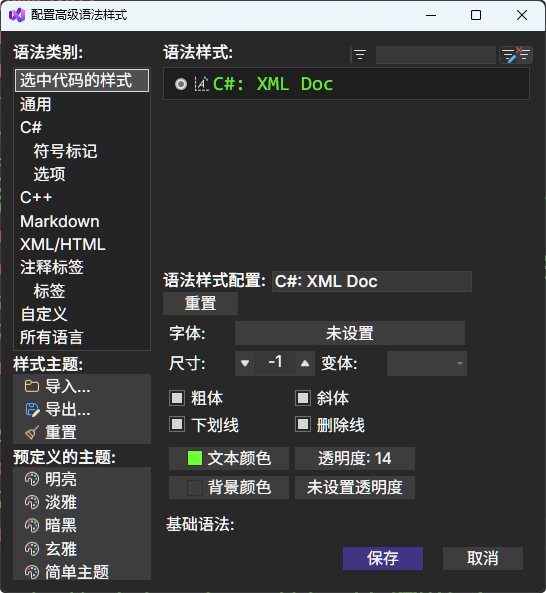

## 对注释的高亮显示

```markdown 
// +++ Head 01 
// ++ Head 01 
// + Head 01
// - head 02
// -- head 02
// --- head 02

// # Notice
// ! Important
// ? Question
// x Remove

// todo 测试
// undone 测试
// note 测试
// hack 测试
```


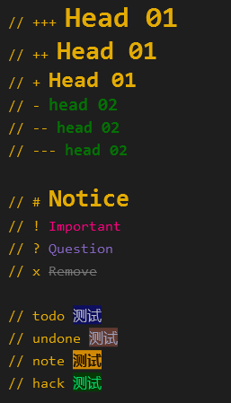

## 对xaml语言的高亮

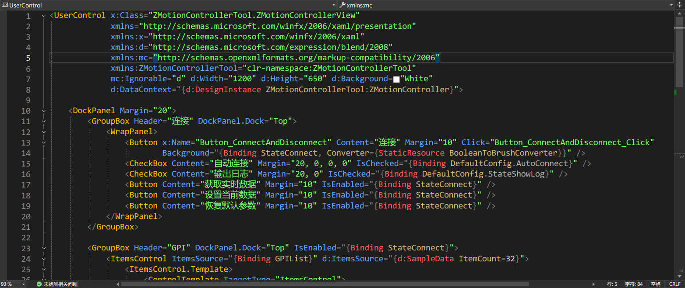

## 快速信息增强

「快速信息」指的是鼠标悬停在C#代码时显示的工具提示。

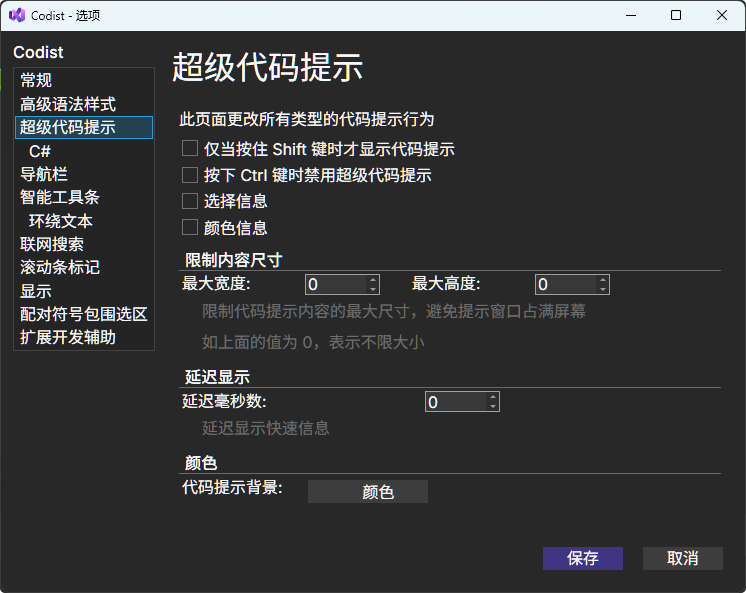

此处对该界面的配置功能进行解释：

    - 「选择信息」：勾选后显示所选区域的字符数和行数（如果跨行）。

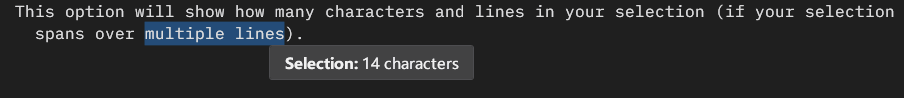

    - 「颜色信息」：勾选后可以预览颜色值

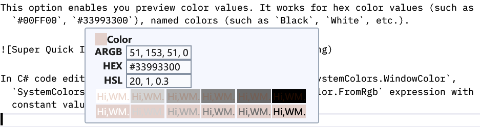

## C#强化代码提示

该功能是对快速信息增强功能的详细设置，在显示C#的快速信息时，提供更多的信息。

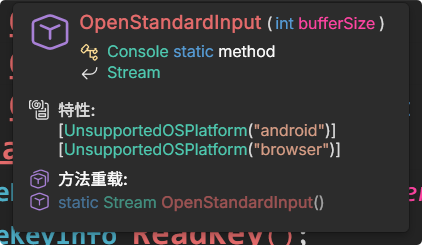

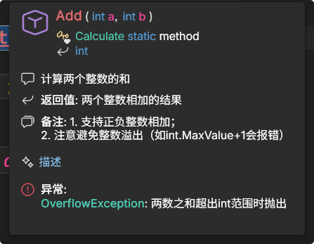

可以在选项界面对需要显示的内容进行配置。

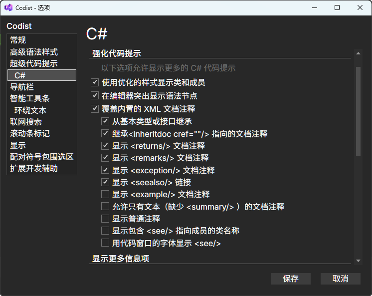

## 导航栏增强

导航栏位于代码编辑器窗口顶部，它会覆盖原有的导航栏。导航栏同时适用于C# 代码文档和Markdown文档。

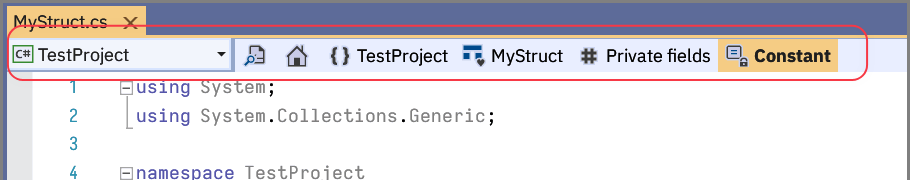

> 如果搜索框中的第一个字符是大写字母，则搜索区分大小写 ；否则，搜索不区分大小写。

导航栏可以在选项页面进行配置：

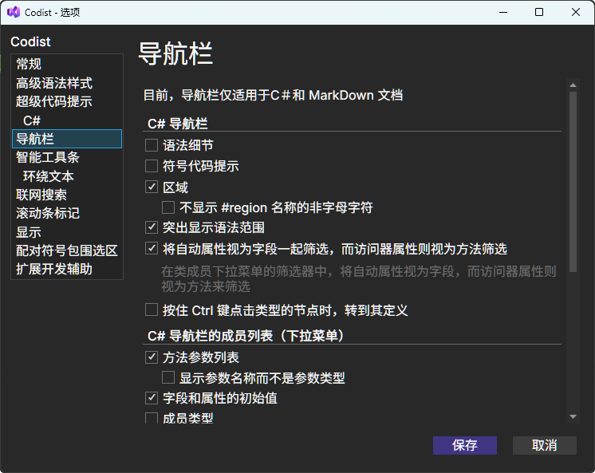

    - 「语法细节」：勾选后还会额外显示函数调用的层级，如`FindAll`在`ConvertAll`中被调用

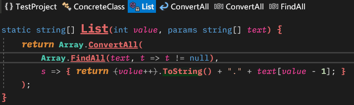

    - 「符号代码提示」：勾选后鼠标悬停在导航栏的节点上时，会显示额外信息

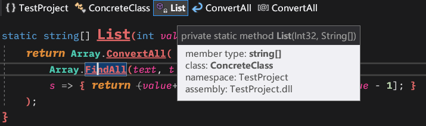

    - 「突出显示语法范围」：勾选后鼠标悬停在导航栏的节点上时，编辑器会高亮显示该节点的范围

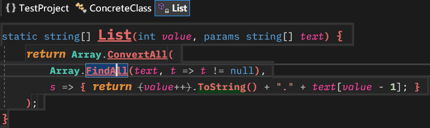

    - 「区域」：勾选后导航栏将显示`#region`名称。如果在region名称中添加了非字母的字符，比如`#region [====== private methods ======]`可以勾选「不显示#region名称的非字母字符」这样就只会显示字母部分`private methods`

## 智能工具条

智能工具条是一个跟随鼠标的上下文感知工具栏。当你选择文本或者双击shift键时会出现。

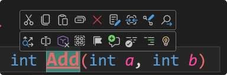

智能工具条通常有两行。第一行包含是通用的文本编辑命令，第二行会根据内容的类型变化。

智能工具条上的每个按钮通常都有多种功能。「左键单击」「右键单击」「Ctrl+单击」和「Shift+单击」会触发不同的命令，参考按钮的提示。

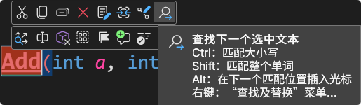

该功能可以在选项界面进行配置。

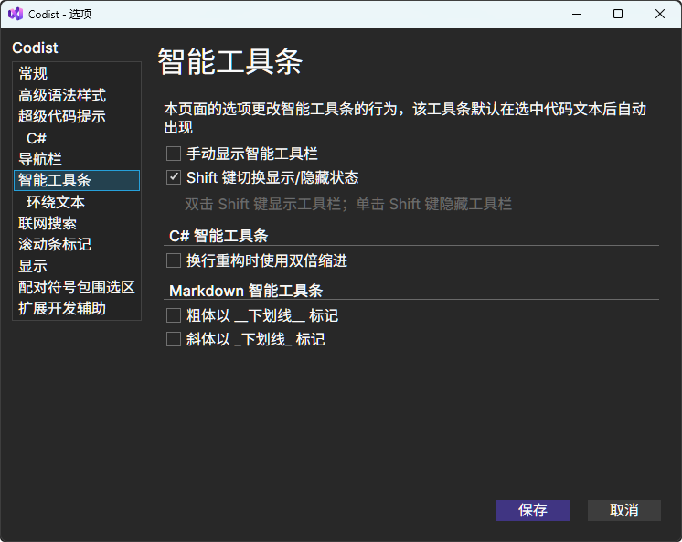

### 转到定义

和F12功能相同，我习惯使用F12，所以用不太上。

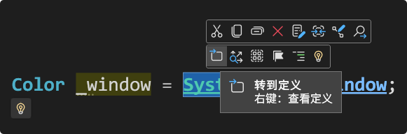

### 分析

使用「分析-列出成员」可以快速查看颜色类中的定义，比如`SystemColors`、`Colors`、`Brushes`。

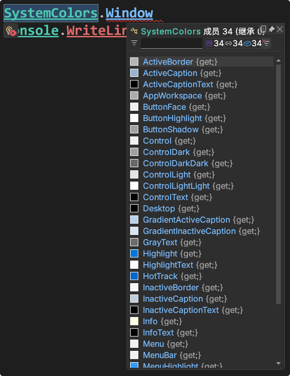

### 标记

对代码中的变量进行标记。不能标记整行，智能标记某个词。可以在对C#语法提供高亮显示中进行配置。

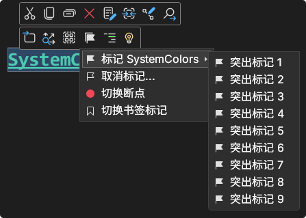

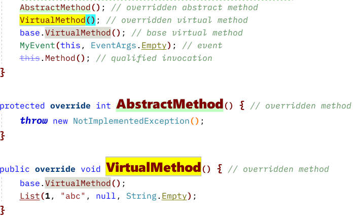

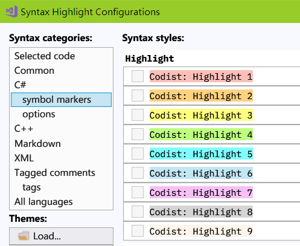

## 滚动条标记

滚动条标记会在垂直滚动条上为一些语法元素绘制额外的形状，如下图中的右侧所示。可以在选项页面更改配置。

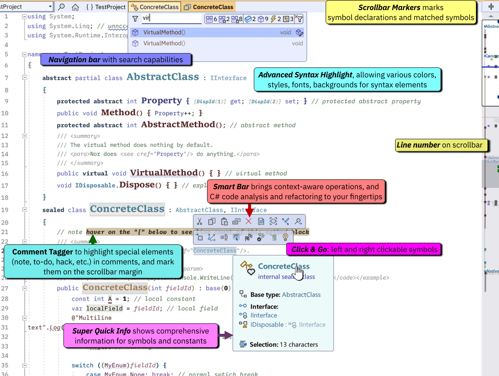

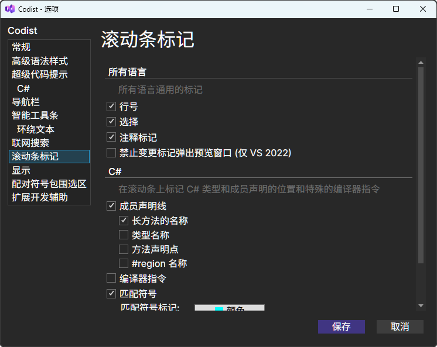

## 自动更改版本号

Codist可以在生成项目之前自动更改输出程序集的版本号，选中项目-右键-自动生成版本号设置。

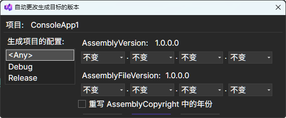

## 显示增强

可以对Visual Studio的界面显示进行优化处理。

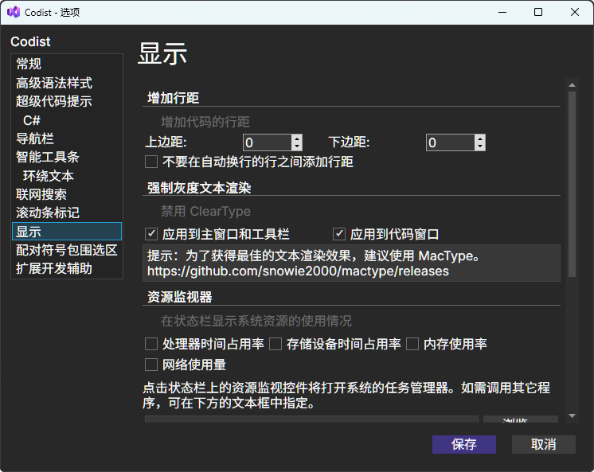

## 自动配对标点符号

Codist可以在输入时，自动为选定内容配对标点符号。

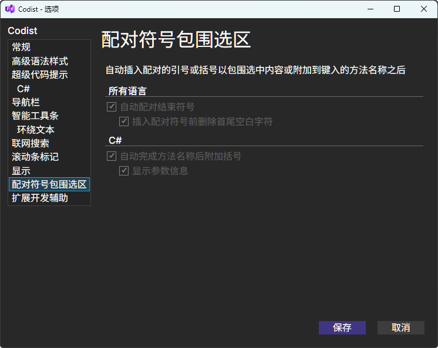

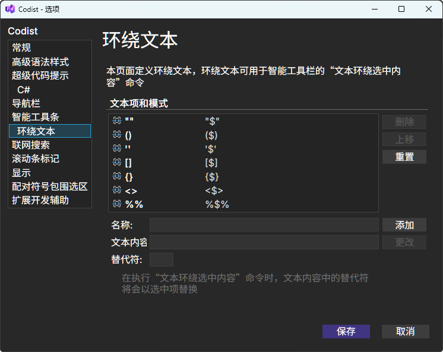

这个功能指的是，选中文本后，输入`"`可以使用`"`包围文本，转化成字符串。

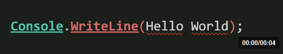

如果关闭这个功能，输入字符会替换所选的内容，而不是使用符号包围内容。

## 额外功能

在「生成」菜单中添加了额外的菜单命令：

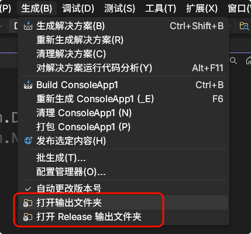
