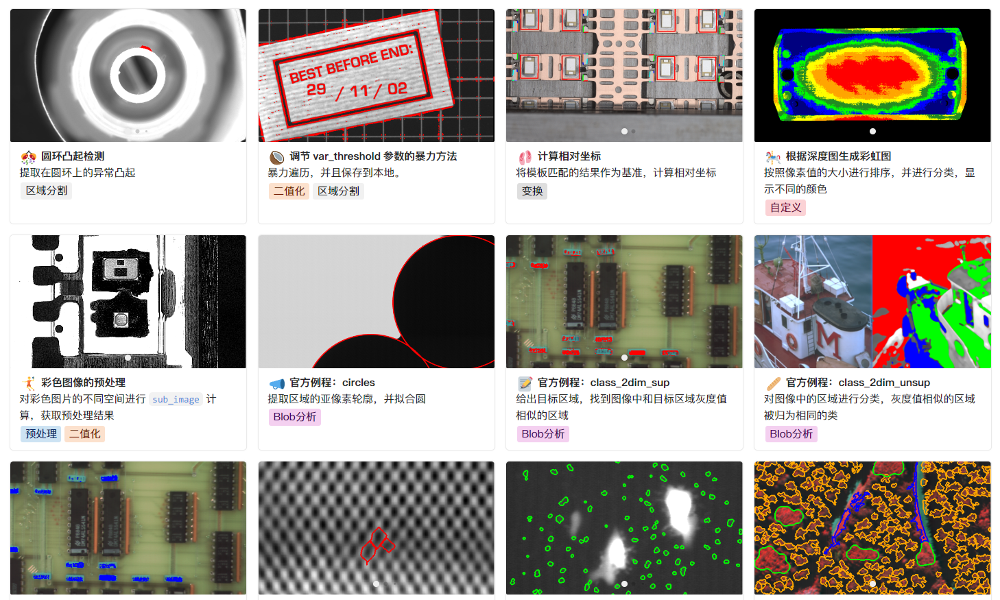

最近发现 Halcon 的官方手册写得很好，于是详细阅读并做笔记。

在我的笔记系统中包含以下文档的中文翻译：

- Solution Guide I.pdf
- Solution Guide II-A.pdf
- Solution Guide II-B.pdf
- Solution Guide II-C.pdf
- Solution Guide II-D.pdf
- Solution Guide III-A.pdf
- Solution Guide III-B.pdf
- Solution Guide III-C.pdf

文档中的案例都做了详细的笔记：

部分例程学习后整理上传到此处：[Halcon 例程](https://gitee.com/Zeros_Zhang/HalconExample)
