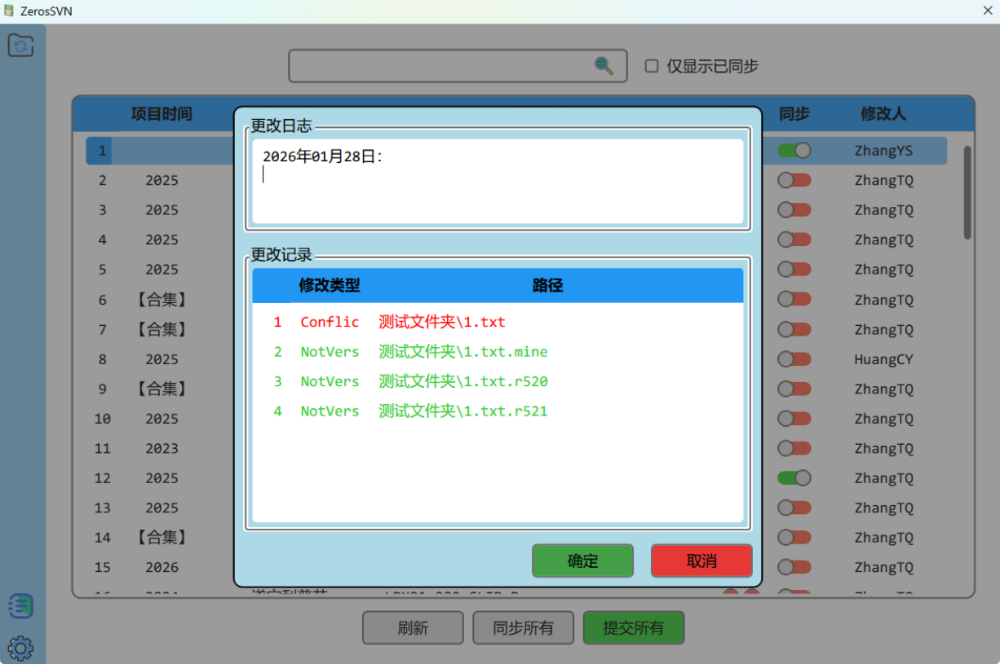
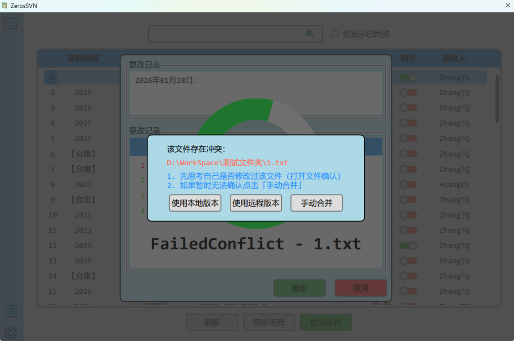
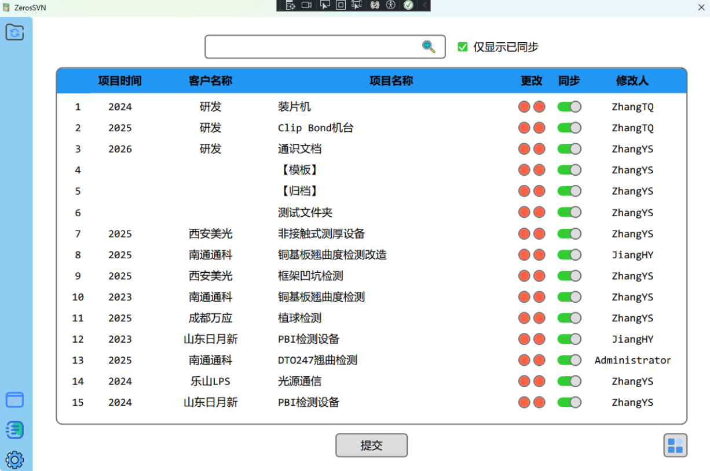
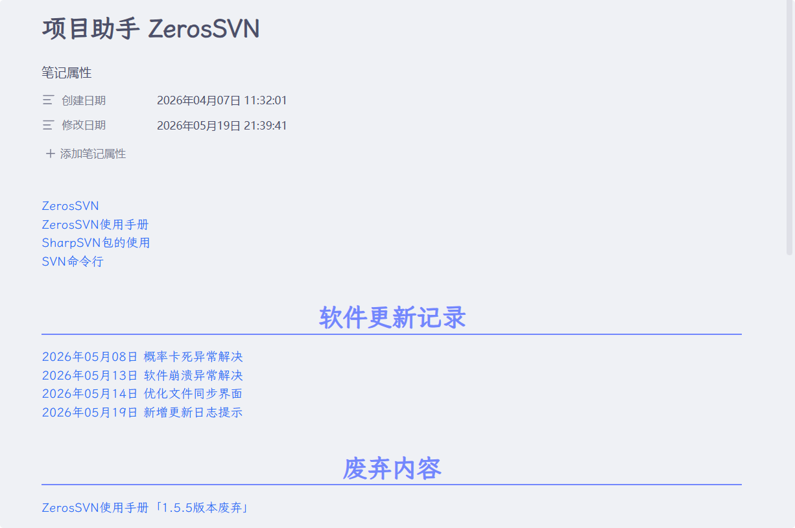
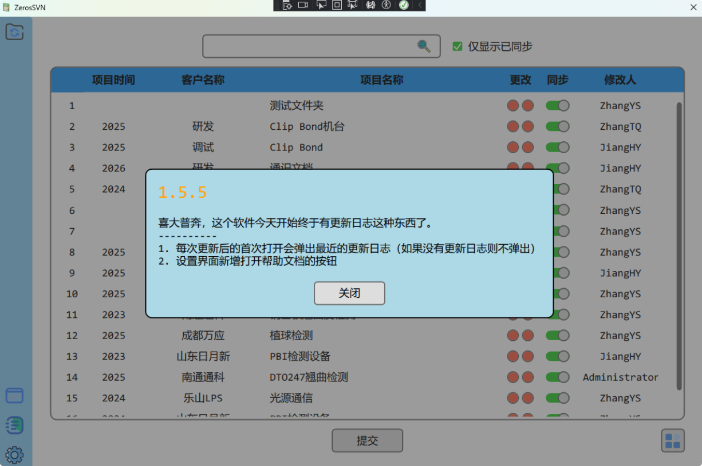
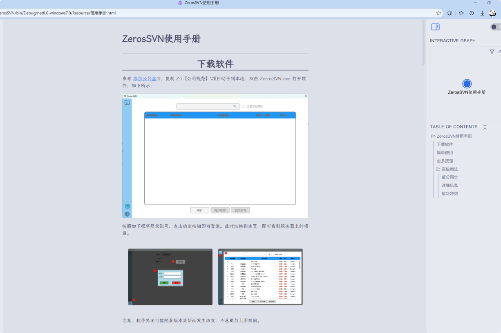

## 碰到的问题

随着公司项目越来越多，在项目的维护方面，我们碰到了如下问题：

1. 多人参与同一个项目，文件相互不同步，需要频繁的使用公共盘共享文件
2. 每个人都有各自对于项目文件的命名方式和存放方式，在员工离职后找不到对应的项目文件
3. 同一个项目在每个电脑上存在不同的版本，想找到对应的版本存在困难
4. 员工的电脑不存在备份机制，如果硬盘坏了，则项目文件会丢失

## 解决方案

基于上面的问题点，需要实现如下的功能：

1. 同一项目的命名方式和文档结构
2. 合并不同员工之间的文件，统一管理，支持同步
3. 项目文件的版本管理和备份

我大概的思路是使用 SubVersion 软件进行管理。在服务端，我在公司的服务器上安装了 VirsualSVN，作为 SVN 的服务器。社区版，白嫖的。

> [!tip]
> SubVersion(SVN) 是一款开源的版本控制系统，用于管理文件和目录的变更历史。
> 和 Git 不同，SVN 使用中心式的文件管理，依赖于服务器，恰好完全满足我的需求。

在客户端的选择上，我首先尝试了 TortoiseSVN，功能确实可以满足，但是相对来说，命令行的操作有点复杂，非程序员学习起来还是需要成本。最严重的一个问题点在于，在 Windows 11 下，TortoiseSVN 的右键菜单项折叠在子菜单里，使用起来很不方便。

> [!note]
> 右键菜单的问题后来我使用 `Nilesoft Shell` 解决了。参考 [软件推荐](../软件推荐)

基于上述的问题和考虑，我打算自己实现一个没有学习成本，操作比较简单的项目助手软件。SVN 相关的操作我使用开源的 SharpSVN 库，这个库没有文档，只有代码内的 xml 助手。

## 实现思路

我和公司的小伙伴们一起整理了目前所有的项目资料，合并到一个文件夹中。并且在 SVN 中创建一个共同的仓库来管理这些文件夹。每个项目修改为 `年份_客户_项目名` 的方式进行命名。如下所示：

> [!note]
> 并非每个项目一个 SVN 仓库，主要是为了好管理，不需要每次新增项目都要我去操作服务器。即使只想同步某几个项目文件夹，也完全可以使用 SVN 的部分同步机制实现。

软件的界面大致如下所示：

- 提供了 SVN 的 Update，Commit 等主要功能，支持项目子文件夹的同步
- 提供了登录账号，可以在 VirsualSVN 中设置不同账号的权限
- 提供软件在局域网内的检查更新的功能
- 提供搜索和排序的功能

## 更新记录

### 2025 年 08 月 21 日

对整个页面结构进行了重新设计，并且实现了对文件冲突的初步管理。

### 2026 年 05 月 14日

本次针对界面内容进行优化：

1. 软件默认「仅显示已同步」，即用户关注和自己相关的项目即可。
2. 进一步简化操作逻辑，三个按钮还是太多了，同事们在使用软件的经常未同步就提交，导致文件冲突。「提交」按钮对应的是 Sync 的逻辑，包含了「Update」和「Commit」，是一套完整的同步逻辑，「刷新」和「同步」按钮归类到「更多」中去。
3. 在 Obsidian 中整理了一下整个项目，距离上一次更新太久了，导致我都看不懂自己写的代码了。

### 2026 年 05 月 19日

基于同事的强烈要求，新增了更新日志提示，并给软件增加了帮助文档。这么做的目的是为了让同事们知道每次更新的内容是什么。

