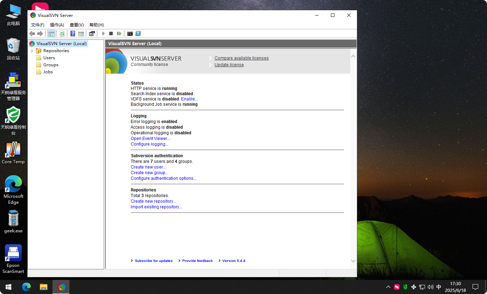
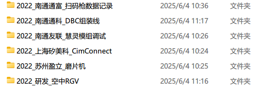
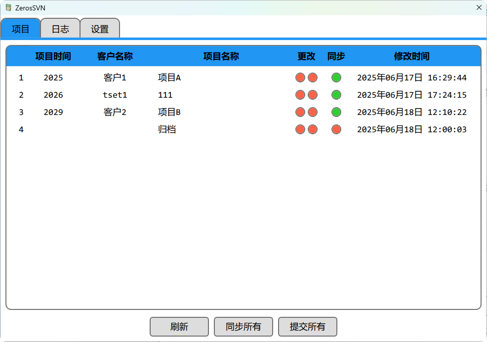

## 碰到的问题

随着公司项目越来越多，在项目的维护方面，我们碰到了如下问题：

1. 多人参与同一个项目，文件相互不同步，需要频繁的使用公共盘共享文件
2. 每个人都有各自对于项目文件的命名方式和存放方式，在员工离职后找不到对应的项目文件
3. 同一个项目在每个电脑上存在不同的版本，想找到对应的版本存在困难
4. 员工的电脑不存在备份机制，如果硬盘坏了，则项目文件会丢失

## 解决方案

基于上面的问题点，需要实现如下的功能：

1. 同一项目的命名方式和文档结构
2. 合并不同员工之间的文件，统一管理，支持同步
3. 项目文件的版本管理和备份

我大概的思路是使用 SubVersion 软件进行管理。SubVersion(SVN) 是一款开源的版本控制系统，用于管理文件和目录的变更历史。和 Git 不同，SVN 使用集中式的文件管理，依赖于服务器。

在服务端，我在公司的服务器上安装了 VirsualSVN，作为 SVN 的服务器。社区版，白嫖的。

在客户端，我首先尝试了 TortoiseSVN，功能确实可以满足，但是相对来说，操作有点复杂，非程序员学习起来还是需要成本。最严重的一个问题点在于，在 Windows 11 下，TortoiseSVN 的右键菜单项，在子菜单里，使用起来很不方便。

> 虽然我使用 Nilesoft Shell 解决了。

于是我考虑自己实现一个没有学习成本，操作比较简单的项目助手软件。SVN 相关的操作我使用开源的 SharpSVN 库，这个库没有文档，只有代码内的 xml 助手。

## 实现思路

我和公司的小伙伴们一起整理了目前所有的项目资料，合并到一个文件夹中。并且在 SVN 中创建一个共同的仓库来管理这些文件夹。

> 之所以不是每一个项目一个 SVN 仓库，是为了上传的时候简单点。

每个项目修改为 “年份\_客户\_项目名” 的方式进行命名。如下所示：

软件的界面大致如下所示：

    - 提供了 SVN 的 Update，Commit 等主要功能，支持项目子文件夹的同步
    - 提供了登录账号，可以在 VirsualSVN 中设置不同账号的权限
    - 提供软件在局域网内的检查更新的功能
    - 提供搜索和排序的功能
