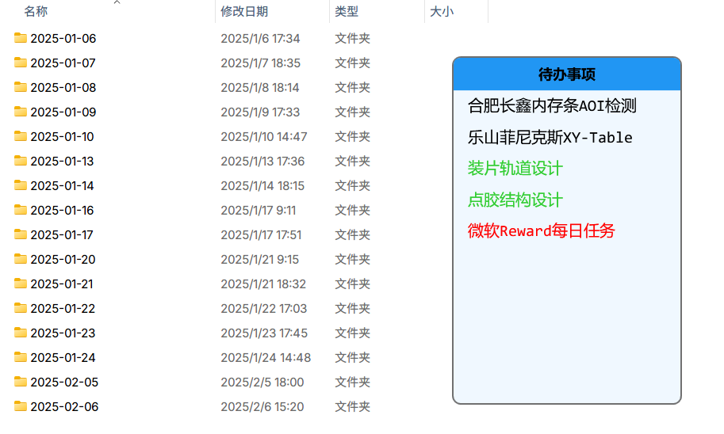
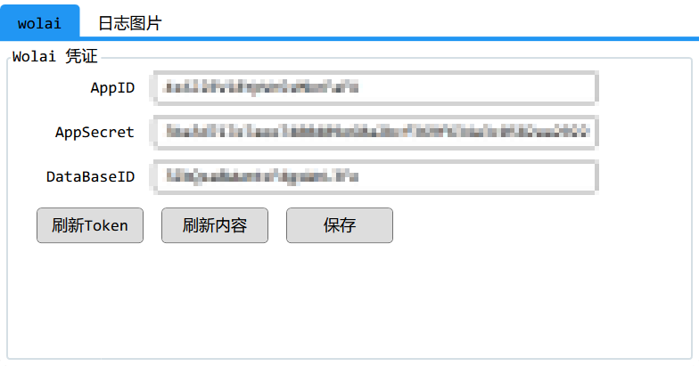
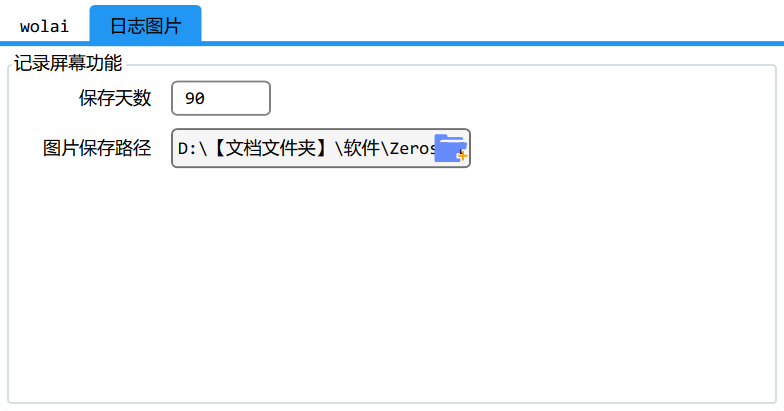
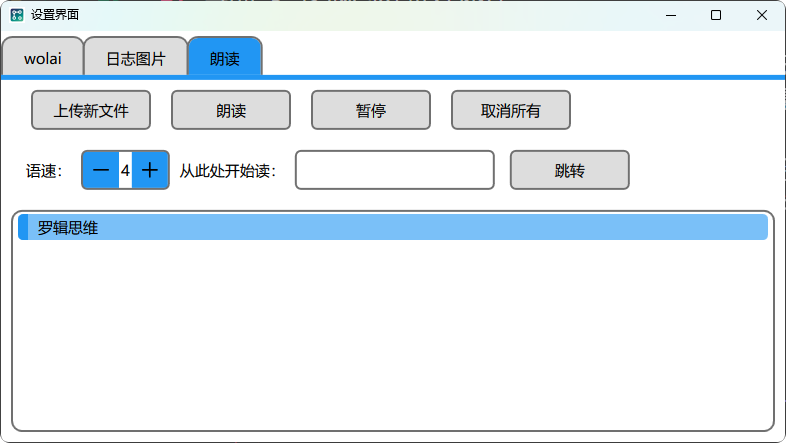
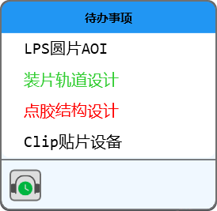

## 碰到的问题

在日常的工作中，碰到几个问题：

1. 经常忘记个别要做的事情
2. 某个事情做完几天后，忘记了当时的情况

因此就实现了一个软件 `ZerosTodo` ，帮助我日常更方便的工作。之前也使用过例如滴答清单、微软Todo、时光序等软件，与这些不同的是，`ZerosTodo` 的数据都存放在 wolai 这个笔记软件中，并通过 api 实现交互功能。

项目代码上传到此处：[ZerosTodo](https://gitee.com/Zeros_Zhang/ZerosTodo)

## 更新记录

### 2025 年 02 月 06 日

这个软件目前包含两个功能：

1. 从 `wolai` 的特定页面中获取最近要做的几个事情
2. 每隔 5 秒截图屏幕并保存

对于需求 1，为了区别于正常的待办软件，我的软件里并没有待办的概念，而是直接把最近要做的几个事情显示在软件的界面上，并置顶悬浮于所有软件上面。我在屏幕专门留了一个角落给他。

对于需求 2，我遍历当前所有的屏幕，并对每个屏幕截图，按照日期保存到指定的文件夹中。同时，为了避免硬盘占用太多，额外新增了一个配置项，超过 90 天的文件夹将会被删除。

### 2025 年 03 月 18 日

新增文字朗读的功能，优化 UI 界面。这个功能可以上传 txt 文件，并调用 Windows 的语音包朗读内容。

### 2025 年 05 月 26 日

新增朗读剪贴板文字的功能。在常驻窗口中增加了一个小按钮，复制文本后点一下按钮，就可以调用系统朗读功能。

### 2025 年 06 月 09 日

新增了一个临时记事本功能，可以拖拽任意内容到悬浮窗口添加内容，也可以直接在悬浮窗口按下 Ctrl+V 添加剪贴板内容。临时记事本会在鼠标离开后的 3 秒自动关闭。

### 2025 年 08 月 21日

这个软件短时间内应该不会再更新了，在实际使用的过程中我发现软件对我的帮助微乎其微。需求是真实的需求，但是软件没有解决这些痛点。

### 2026 年 06 月 03 日

我将笔记软件从 wolai 更换到了 obsidian，在此过程中我一直在思考如何优化笔记系统。上述的需求我已经通过 obsidian 的侧边栏插件实现，参考 Sidebar Home。