# 先进封装

> 🦪[https://www.bilibili.com/video/BV1Yu411c7ic](https://www.bilibili.com/video/BV1Yu411c7ic/)

所谓封装，就是给芯片加壳后再连接电路。

## 传统的封装

半导体的后道工艺通常包含以下内容：

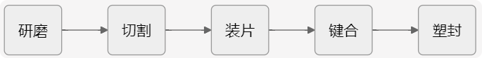

而本文会着重解释键合和封装的工艺。传统的键合是先进行芯片键合，再进行引线键合，然后套一层壳。

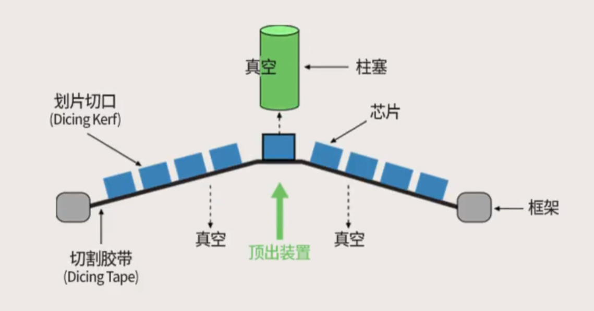

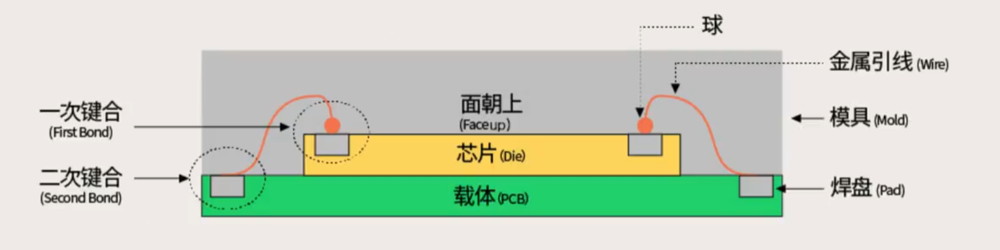

- 芯片键合——Die Bonding
- 引线键合——Wire Bonding
- 倒装芯片键合——Filp Chip Bonding

> 🦪 传统封装的缺点：
>
> 1. 引线框架比较大——芯片体积大
> 2. 金属引线比较长——信号传输耗时长

## 封装的发展

1. 裸片贴装——引线键合
2. 倒片封装——焊球/凸点
3. 晶圆级封装——RDL 重布线层
4. 2.5D/3D 封装——TSV 硅通孔技术，chiplet 封装技术

> 🦪 每一代技术之间的本质区别，就是芯片和电路之间连接方式的区别

## 倒片封装

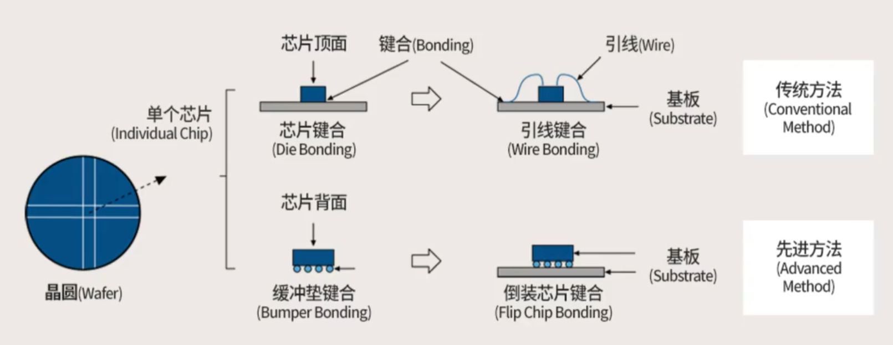

芯片电路层朝下，通过金属球将芯片与电路连接，有效减少了芯片的体积，提升了传输速率。

需要用到曝光，刻蚀，沉积等工艺。

## 晶圆级封装

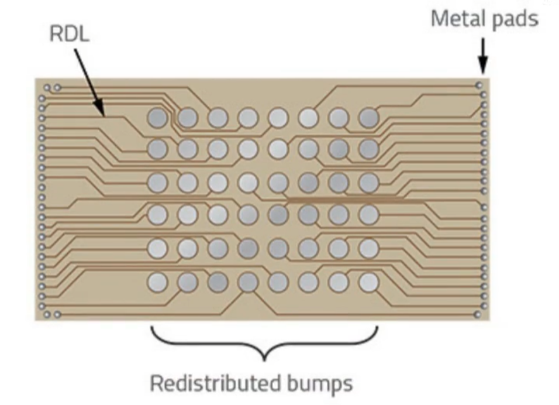
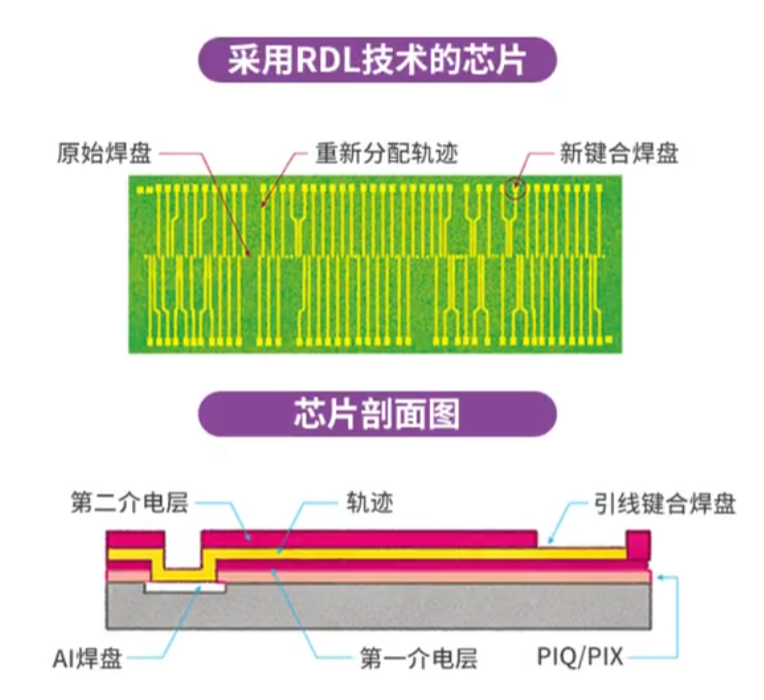
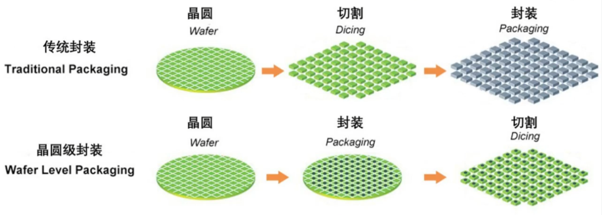

这种叫做扇入型封装。该封装方式的缺点在于芯片的保护性不强，且可能会导致后续发生变形。

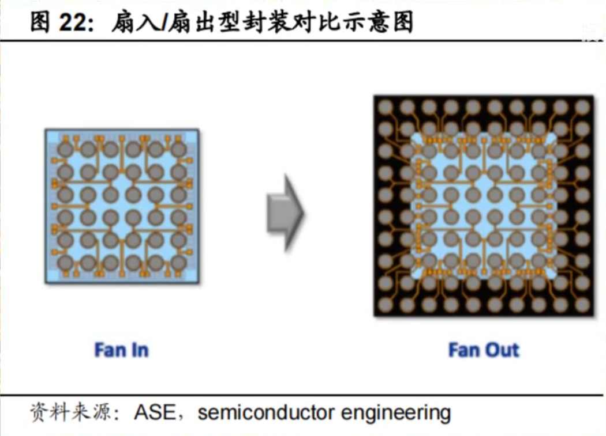

这种方式叫做扇出型封装，在扇入的基础上增加一层保护壳。

## 2.5D/3D 封装

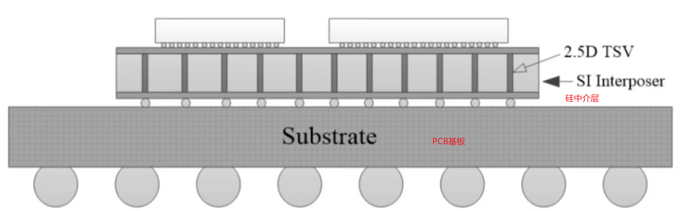

将两个芯片放在同一块硅中介层上，再将其放在 PCB 板上，作为一个完整的芯片。

这种方式的做法是可以有效的增加两块芯片之间的通信效率。

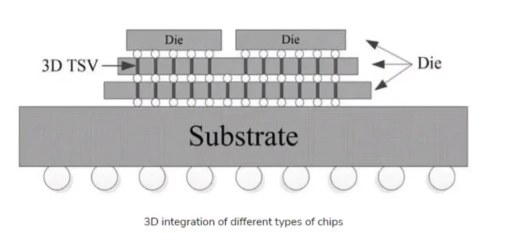

3D 封装去除了硅中介层，将芯片与芯片直接相连。

3D 封装依赖于 TSV 硅通孔技术，即在硅上打通孔，然后在通孔上填充金属材料，这样就可以把芯片一层一层的串联起来。

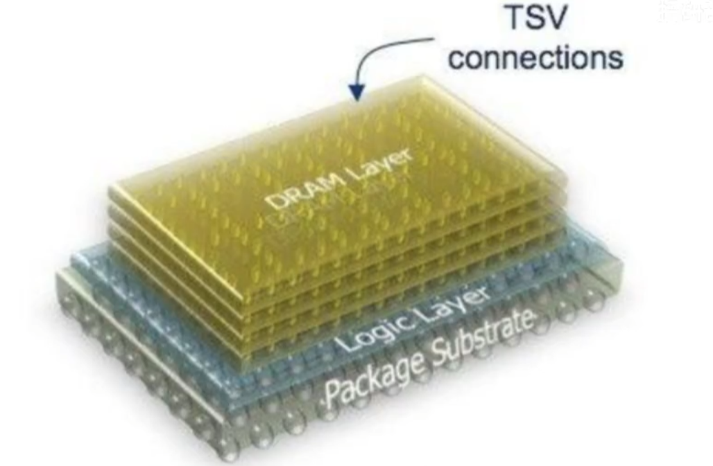
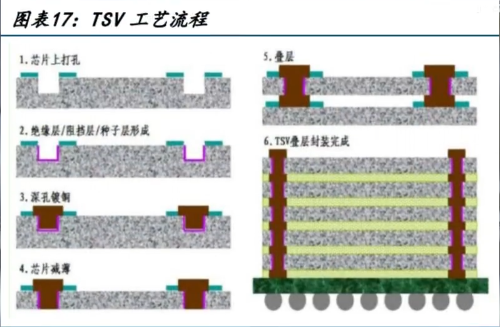
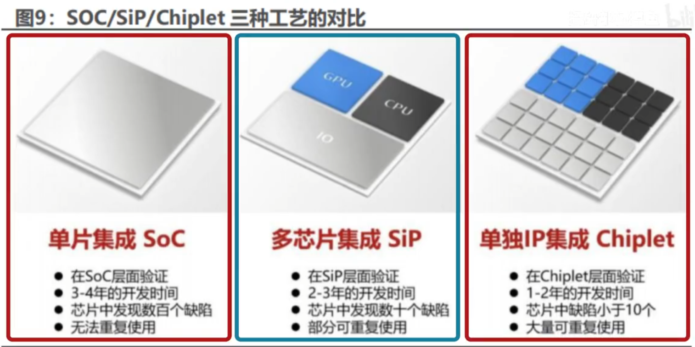

Chiplet 芯粒：一种按照功能对现有逻辑芯片进行拆分并使用硅通孔堆叠实现互联的技术。
