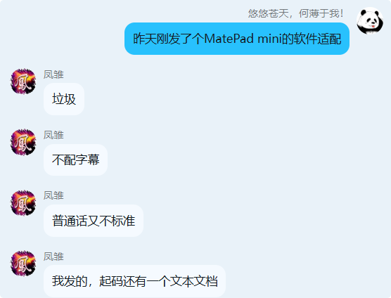

## 事情的起因

前两天在一个呆了很久的 QQ 群吵架了，是为了一点非常小的摩擦——我在群里发了 MatePad mini 的软件适配实录，立马就有人出来批评我视频做的不好，标题起的不好，不知道我这个视频想表达什么之类的巴拉巴拉。

站在我的角度来看，我只是花了 5 分钟录屏，全程没有说话，然后上传 B 站，来演示鸿蒙平板下的软件适配。我完全不理解为什么要被批评。是因为我视频做的不好所以要被批评吗？总之后续我也不服气，我心里想的是我视频都没配声音，你出来说我普通话不标准，是什么意思？完全是我不管我说什么，反正就骂我就完了，完全是为了反对而反对。

后续就是愈演愈烈的争吵，他认为他说我视频里问题很多，没背景乐，没配音，没字幕，没有重点，标题只说适配，内容不能直接看出等等。当然这也是事实。那为什么我还会生气呢？

我们在意的点不一样。从对方的角度来说，他说我视频做的不好，而我生气了，是在反驳「视频做的不好」的观点。从我的角度来说，我真正生气的其实是，他为什么要随意评价我？

## 对网络争吵的分析

人们总认为自己有资格评价别人，又或者认为反正自己说的也是事实，别人也必须接受。坏事就坏事在这两点原因上。

你究竟有没有资格评价别人？这个问题有很多的观点，比如「我没吃过猪肉还没见过猪跑吗？」，再比如「人是一种很有趣的动物，在自己做对、做好之前，通常已经了解做对、做好是什么样子。于是，无论能否做对、做好，人都觉得自己有能力判断别人是否做对、做好。」对于这个问题我的观点是「我们花了两年学会说话，却要花上六十年来学会闭嘴」。不论你是不是有资格评价别人，不评价别人是更好的选择。

我说了一个事实，别人就必须接受吗？这个问题也有很多的观点，而这正是这篇文章的主题——大多数争论都是与自我意识有关，而非理念。在绝大部分情况下，我们根本不是为了事实在争吵，甚至也不是为了观点争吵，而是为了让自我意识胜过别人的意识，俗称「想赢」。

事实一定重要吗？或者说正确的观点就一定能被人接受吗？我们每个人都在上学期间有过被父母耳提面命式的教育过要好好学习，这正是足够正确的观点。但是从高考分数来看，大部分人都听不进去。听不进去是因为这个观点不正确吗？我认为不是。反而是很多人说出正确的观点并非是想让对方接受，而是想评价他人，甚至教育他人。

在这种情况下还有一种更极端的想法——我说的话没错就行，我为什么要关注别人的情绪，不接受就是别人的问题。当你做销售的时候希望客户买你的东西，还知道要照顾客户的情绪，要高情商，不要乱说话。为什么反而到了自己的朋友这里反而要用「我说的是事实」而不管不顾朋友的情绪呢？

如果你的朋友开始随意评价你的行为，那最好远离他。我不确定这种行为是否算是一种 PUA，但总之我不喜欢被随意评价。当他说出「我说的是事实」类似的话，那正是他在合理化自己的行为，是一种自我意识过度发展的现象，不管你说什么，他都已经听不进去了，除非他把关注点从事实移动到情绪上。

对于那些萍水相逢的人，就更加要远离了。因为他们对别人的情绪毫无心理负担。