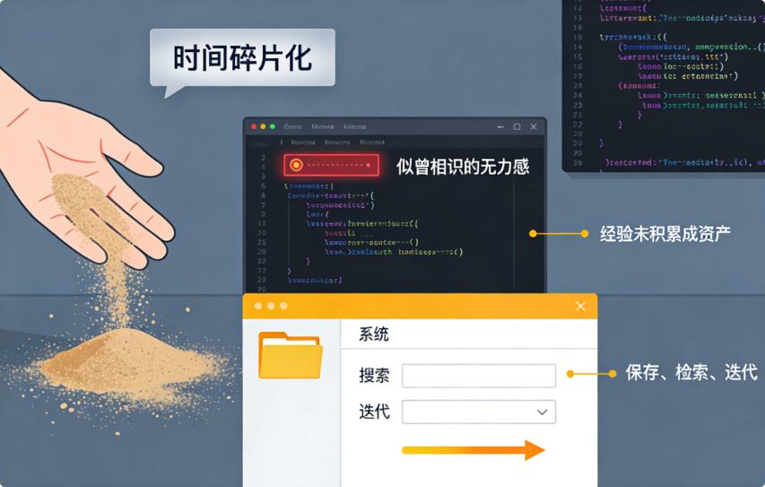
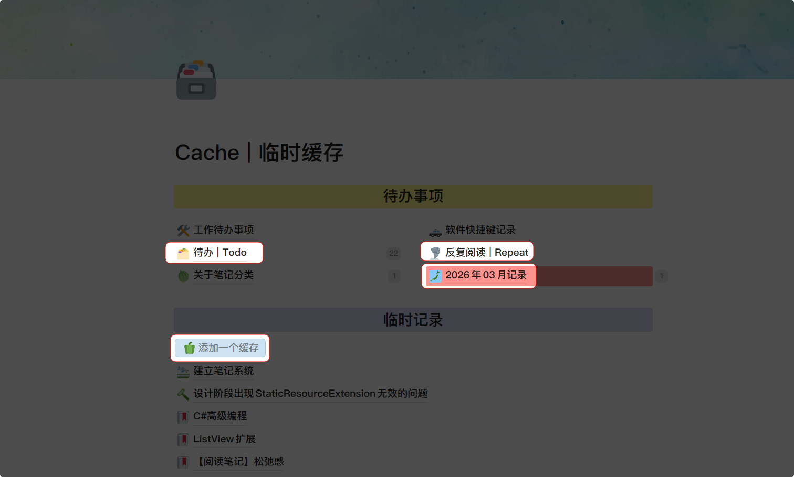
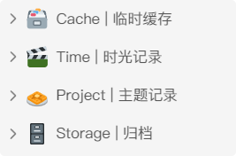
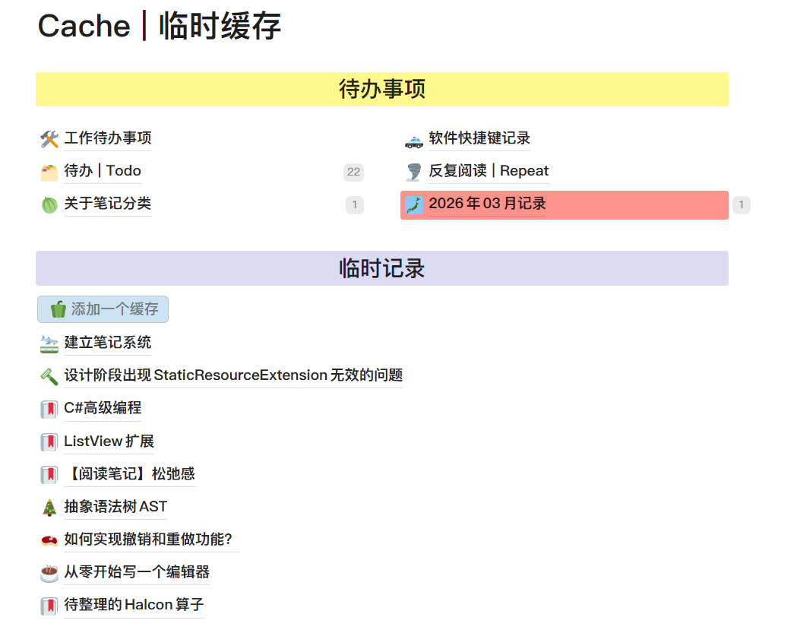

## 工作遇到的困难

十年的工作中，我感受最深的就是「时间碎片化」——碎片化的时间给我带来的是似曾相识的无力感。我明明解决过这个问题，但是却一遍遍的重新踩坑。我的工作经验没有积累成资产，而是像沙子一样，每次努力抓一把，但是随着时间的流逝，最后都从指缝溜走。

    - 我曾经看着代码抛出一个我清晰记得碰到过的异常，但是死活想不起来之前是如何解决的
    - 我曾经被老板问到这个版本的软件有哪些改进，而我却没法给出在调试时的对比
    - 我曾经看着自己上周自己没写完的代码，但是完全不知道自己接下来要做什么

那一刻我深刻的意识到：我需要一套系统，让我的经验可以保存、可以检索、可以迭代。

## 笔记系统的功能

那么我到底需要一套什么样的系统来帮助自己？首先我需要明确自己的需求：

    - 记录自己做过的工作
    - 记录学习过的知识
    - 记录自己曾经犯过的错误和解决方案

这些需求总的来说就是「记录和总结」。高中时期经常听老师念叨一句话——“好记性不如烂笔头”，那时候抄写老师上课的板书，会将自己的理解当作评价写在边上，这就是一种笔记系统。

## 建立笔记系统的原则

笔记系统必须同时包含「输入和输出」，输入是你记录的内容，输出是你对内容的总结。

一个好的笔记系统，必须遵循这三个原则——存得住、找得着、用得上。

    - 存得住：确保有价值的的信息不会丢失；否则会依赖记忆力，非常容易出错
    - 找得到：当你需要的时候可以快速定位；否则会有信息黑洞，越记录越焦虑
    - 用得上：去掉没用的内容，只保留核心；否则需要花时间重新学习总结

## 笔记系统的误区

**🍡 笔记系统不是收藏夹、素材库**

这种错误表现为使用剪藏插件疯狂收藏，但是从来不打开。会导致需要的时候找不到，找到了不过是把曾经看过的东西再看一遍。保存≠学会，收藏是输入，学会是输出。

**🌝 笔记系统不是复制粘贴**

这种错误表现为笔记里大段的原文，没有自己的思考，复制别人的模板，但是从未具体问题具体分析。这是一种拿来主义，所有的经验必须自己去实践才可以获得。近期这种错误表现为使用AI总结内容。

**🎞️ 笔记系统不是博客**

这种错误表现为花了大量的时间美化排版、配色。博客热衷于表达，而非使用。

**📄 不要陷入完美主义**

这种错误表现为对一篇笔记反复修改，每个笔记都要标签齐全，链接完善，记录的内容也要尽善尽美。记笔记不是编写一本书，笔记本身就是零碎的。

**🩺 不要陷入工具主义**

这种错误表现为频繁更换笔记软件，经常比较不同软件的高级技巧，但是却使用不好基础功能。不要把搭建系统本身当作目标，搭建系统只是服务工作的手段。

## 如何用好笔记系统

**🦚 养成随时记录的习惯**

灵感一闪而过，如果不能立马记录，可能转头就忘。我想表达的重点是「养成记录的习惯」，而不是去追求一键记录。这种记录方式可以只写一句话，一个关键字，不用追求完美记录，等后续再进行整理。

**🔔 要对笔记进行分类**

笔记分类是为了可预测的定位路径，在需要的时候知道去哪里找。分类只需要分几个大类就行，没必要非常细化。虽然搜索功能可以很方便的定位，但是你仍然需要知道笔记大概在哪里。

**🍊 经常翻看自己的笔记**

笔记的价值在于复用，定期回顾才能持续迭代。所谓温故而知新，在不同的时间看同一篇笔记会产生不同的感悟。审视过去的自己，也是一种成长。

## 我的实践

接下来我将基于上面的原则，讲述我的笔记系统实践。

### 🥘 我使用的软件——wolai

我使用wolai来记录笔记，有以下几个理由：

1. 支持斜杠命令、Markdown标记
2. 笔记之间相互链接的功能做的比较方便
3. 支持Latex数学公式截图识别
4. 笔记存在云端，不用折腾同步功能，支持导出
5. 被阿里巴巴收购了，不太可能随时暴毙

当然这个软件也有一些缺点：

1. 2021年曾经出过一件事，软件团队检测用户笔记内容，对敏感或擦边的内容进行和谐处理。这也是所有云笔记的缺点，但是我个人没有类似的烦恼。
2. 几乎没有可以自定义的功能，作为一个笔记软件竟然没法修改字体！
3. 2025年下半年开始更新频率显著降低，几乎没有新功能出来了。
4. 绘图功能做的不好，只提供了思维导图，绘制流程图要么使用`Mermaid`要么在`draw.io`画完之后截图粘贴——`Mermaid`不好调整，`draw.io`截图不好修改。绘图方面做的最好的是飞书文档。

市面上的一些其他软件我也有试用过，这里就讲讲我不选他们的理由：

1. `notion`：可以说`wolai`是仿照`notion`实现的软件，`notion`在功能上比`wolai`强大很多。我最终没有选择`notion`主要有两个原因——网络问题和本地化问题。网络问题不多说，网上很多人讲。本地化问题是我认为`wolai`做的比较好的方面，比如`/dmpd`输入代码片段，`/hngs`输入行内公式，实际上输入`/dm`和`/hn`就可以了，我还是更习惯使用拼音首字母。
2. `obsidian`：社区插件丰富，个性化程度高。笔记本地化存储，数据安全。我没有选择`obsidian`的原因也正是由于这两个特点：第一是个性化程度太高了，太折腾了，会引诱我不断去折腾插件。第二是手机端的问题，`obsidian`手机端做的没有`wolai`好用
3. 飞书：飞书文档是作为一个功能模块放在飞书里面的，除了文档功能飞书的其他功能也很好用，我们公司就使用飞书办公。飞书的文档不能导出为`markdown`格式，只能导出为`word`格式，有浏览器插件提供导出`markdown`的功能。最核心的一点是如果我要更换笔记软件，我必须一篇一篇的导出，不能做到全部导出，而`wolai`提供了这个功能，虽然这功能做的一般。
4. 语雀：语雀也是阿里系的笔记软件，我也不知道为什么阿里要整这么多笔记软件。语雀更适合用来作为博客，而不是用来做笔记。语雀的文档系统和飞书一样都是知识库，也不能全部导出。另外语雀和飞书的笔记链接的功能做的都没有`wolai`好，可能知识库的定位就是用来展示的。

我还使用过印象笔记，思源笔记，有道云文档，logseq，Typora，VSCode，OneNote，为知笔记，trilium等，太多了也没法全部点评。总之，正如我上面提过的，记笔记的目的是服务于生活，而不是建立系统。各位读者可以自行试用或者看网上一些笔记软件的评测，选择合适自己的笔记软件。千万千万千万要记得不要陷入工具主义陷阱。

### 🍠 我如何实践「存得住」？

一般来说我都会在「临时缓存」中进行记录零碎的想法和整理笔记，整理完后放到「主题记录」中对应的页面中。所以「临时缓存」对我来说就是笔记的入口，所以在这个页面，我做了以下工作：

1. 创建一个「待办事项」页面，任何笔记中我认为没有完成的部分都会引用这个页面，这样我进入到这个页面，就能看到自己给自己留下的任务
2. 创建一个「反复阅读」页面，任何我认为近期需要复习的内容，都会在这个页面添加引用。
3. 创建一个「自动按钮」用于快速的添加页面，简化我的记录操作。
4. 创建一个以月份命名的页面，用于写日志。这个页面会以流水账的形式记录工作事项，主要是为了记录自己过去一段时间做了什么，这样可以督促自己思考。

`wolai`还提供一个微信小程序，给微信小程序发送链接或者文字，就会转存到固定的页面中，我设置了「临时缓存」。

我习惯使用单一入口记笔记，而不是在对应的页面记笔记。一方面是为了更快速的记录，另一方面也是为了可以看到自己有哪些还没有整理过的笔记。所有的一切都是为了「记得住」。

### 🍉 我如何实践「找得到」？

我并没有采用常见的如PARA、卡片、数字编码、标签等分类方法，我是完全按照我自己的使用习惯进行分类的，这也是我说的一定要自己去实践，不要直接使用别人的模板，模板只是作为一个参考。

我的笔记主要分了四个大类：

1. 临时缓存：这个页面提供的是收集箱的功能，我平时在网上看到的好的文档，临时的想法，随手的记录都会丢到这个里面去，然后有时间就整理。

1. 时光记录：这个页面提供日记的功能，里面的文档以日期为标题，仅用来记录我生活中的一些经历，感悟等。我希望等我老了的时候回看自己的日记，会发出当初我竟然还这样想过的感叹。

1. 主题记录：这个页面是笔记的核心页面，可以说这个才是笔记系统的核心内容。

    - 「备忘录」：记录我自己和我爸妈的账号密码，记录家里的宽带账号密码，记录房屋租赁的收入与花销，记录汽车保险信息，医疗保险信息等生活信息
    - 「零碎知识」：记录我在互联网上学到的一些知识，内部包含三个模块——what、how、why。这个页面里的内容使用频率不高，只是为了增加自己的知识面。
    - 「阅读记录」：包含书籍阅读笔记、博客阅读笔记和其他文章阅读笔记
    - 「电子数码」：比如机械硬盘的原理、固态硬盘的原理、路由器和交换机的区别、常用的CPU
    - 「软件」：我是一个很喜欢尝试新软件的人，所以我单独给了一个页面用于记录自己曾经用过的软件，比如这个软件是做什么的，有什么优点，什么缺点。
    - 「游戏」：我会记录一些游戏的攻略，比如泰拉瑞亚的流程，星露谷mod的安装等内容
    - 「教育相关」：去年年底有了自己的孩子，于是平时看到的一些教育相关的内容，都会放到这个里面
    - 「自动化」：我本人从事自动化设备行业，这个页面记录的是工作中的内容，比如相机如何选型，某某品牌的运动控制卡如何操作，GRR的计算方式，半导体先进封装工艺等
    - 「编程知识」：记录和编程有关的知识，比如Python开发，Vue开发，Andriod开发，OpenCV的使用，红黑树和二叉树的区别等
    - 「CSharp语言」：我的工作主要是使用C#语言，因此单独给了一个页面，记录Winform和WPF相关的知识，功能案例，优化技巧、异常处理等
    - 「数学推导」：包含编程中使用到的数学知识，比如直线拟合、三维旋转、射线与包围盒相交检测等
    - 「AI」：最近AI很火，所以单独开了一个页面记录相关的内容
    - 「公司管理」：包含如何跟同事沟通、如何解决团队分歧、招聘时关心的问题等内容
    - 「成长」：会记录可以提升自己思维的内容，比如工具祛媚，创作还是消费，效率成瘾等，我希望自己可以成为更好的人。

笔记分类其实没有统一的格式，我没有模板分类的原因是因为，我认为他们都太全面的，而我不可能做到那么全面。我只需要把我生活工作中的重要内容单独提取出来即可。

1. 「归档」：这个页面会存放剪藏的文章，我正在考虑是不是要将其删除，因为在阅读后我已经将内容总结到我的笔记中了。这些原来的剪藏内容，我不但再也没有看过，反而会增加我搜索的难度。

### 🥑 我如何实践「用得上」？

在笔记的编写上，我也一些习惯可以分享。

1. 明确的命名。比如我在一些页面明确what-why-how，以让我快速知道这个笔记里的内容。
2. 尽量少的标题层级，我一般只会使用二级标题和三级标题。标题层级如果太复杂，会让笔记显得很乱。
3. 持续迭代笔记，相同主题的笔记合并为一个，相关主题的笔记相互链接。
4. 在保证内容清晰的前提下，使内容尽可能简短。你的笔记不需要给别人看，因此你要记录关键信息，让自己看得懂就行。
5. 尽量自己手动记笔记，AI只提供辅助。只有自己记录的内容才会记忆深刻，AI总结然后复制粘贴后的内容很容易忘记。

## 总结

这篇文章写到这里，还是有很多细节没有提到。我原本应该添加更多的截图，以展示我是如何做的，但是转念一想，又觉得似乎我给出的经验，也是一种模板。我的模板对别人可能并没有什么用，只要保持上文提到的三个原则——存得住、找得到、用得上，都是适合自己的笔记系统。
