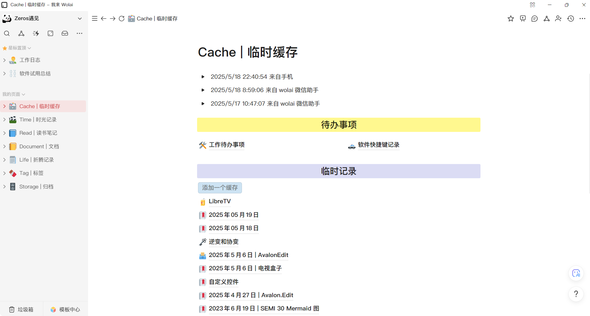
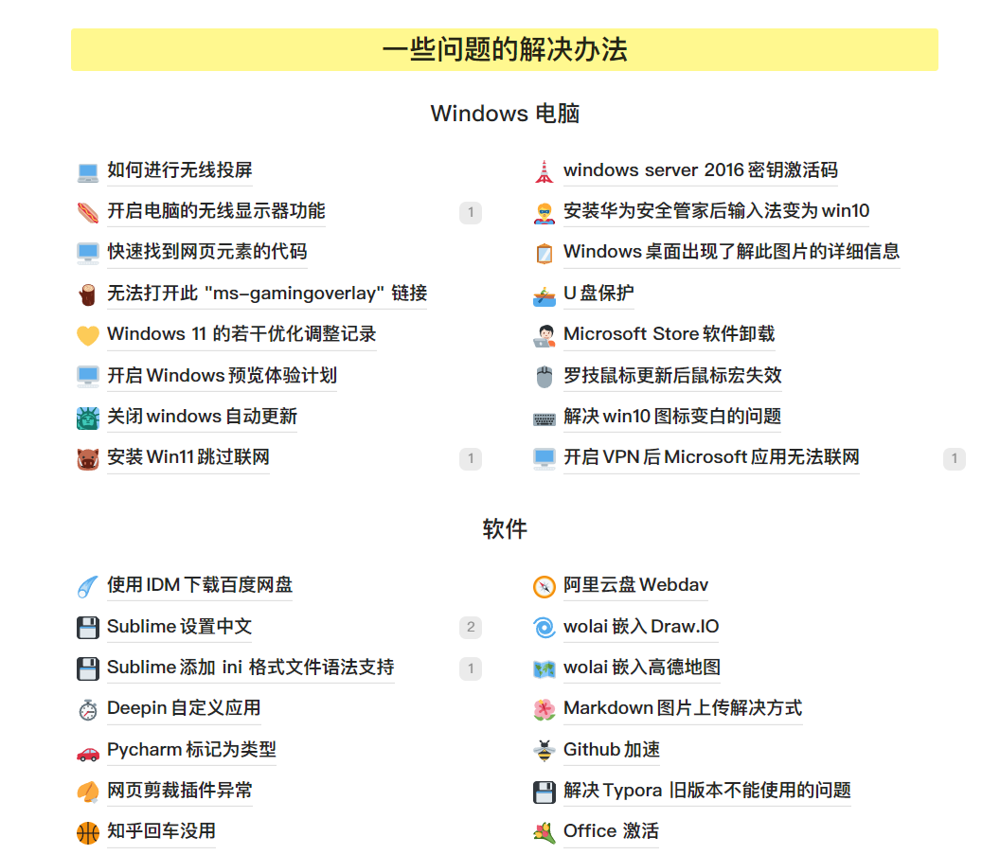
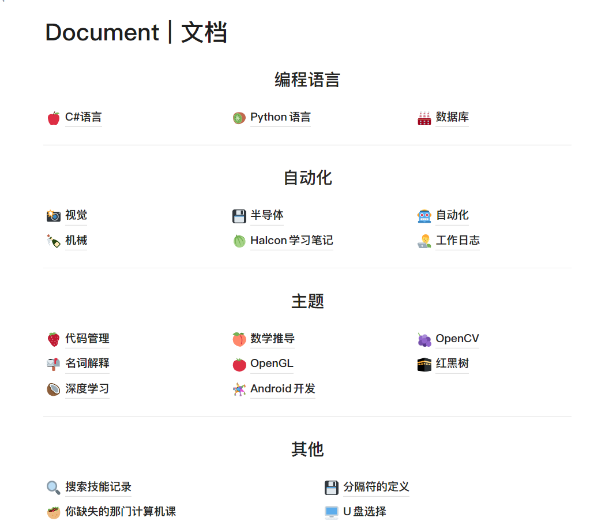
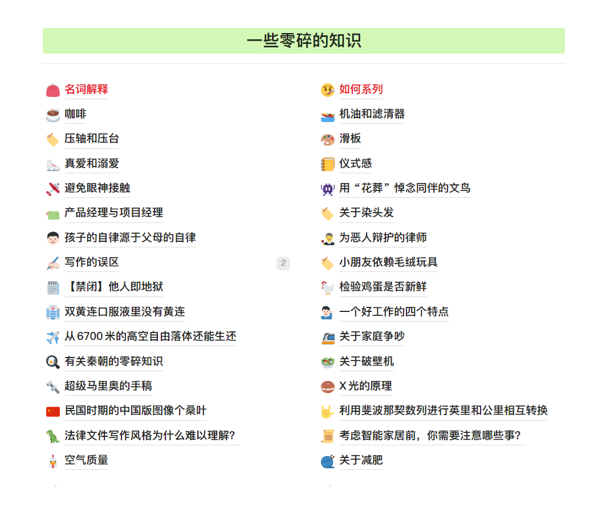

## 关于笔记软件

迄今为止，我使用过一些笔记软件，比如 AnyType，Notion，语雀，思源，Obsidian，Logseq，TiddlyWiki，Trilium，Joplin，飞书，wolai 等软件，最终我的选择是 wolai，原因是「中文」和「不用折腾插件/同步等问题」。

另外其他几个软件都或多或少有一些不是很符合我需求的问题：

- TiddlyWiki：用法比较奇怪，会把所有的笔记记录到一个 HTML 文件中，我不太习惯。
- 飞书：「画布」功能是所有软件里做的最好的，能够把「流程图」和「思维导图」合并在一起，但是飞书软件太大了，而且得安装插件才可以导出 Markdown 格式。
- Obsidian：网上特别多人使用的笔记软件，有插件系统，可以说是一个笔记版本的 VSCode，但是太折腾了。
- 语雀：之前使用的笔记软件，并且在该平台上创建了我第一版博客，后来语雀必须冲会员才能公开博客，所以我就放弃了。

wolai 是国内仿 Notion 很成功的一款软件，最近还被阿里巴巴收购了，合并到钉钉个人版中。由于免费版能使用的功能较少，所以我买了 6 年的会员。

在此推荐：https://www.wolai.com/signup?invitation=7VKA7NI

## 笔记结构

我大致将我的笔记分为以下几个部分：

- 临时缓存：用于存储网页分享，微信助手，临时记录等内容
- 时光记录：个人日记
- 读书笔记：包含看过的书/论坛/网页等的总结和注释
- 文档：技术性的一些文档，如 C#/自动化/视觉/OpenCV/OpenGL 等
- 折腾记录：一些零碎的知识点
- 标签：都是空白的页面，给其他页面引用，以实现 wolai 中没有的标签系统
- 归档：草稿内容

## 博客更新笔记内容

由于我的笔记中内容太多，并且有很多内容不适合公开，因此该博客内，仅更新部分我觉得比较好的内容，可以点击 `笔记` 标签查找这部分内容。

## 2026年04月11日更新

那就好好告个别吧！

我意识到 wolai 已经快半年没有更新任何功能了，同时马锐拉从钉钉离职，让我对这款笔记软件的未来充满担忧。

我打算逐步将笔记中的内容迁移到 Obsidian 中了。
