## 红黑树诞生的背景

普通的二叉搜索树在添加有序数据（递增或者递减）的时候，所有的节点都会在根节点的右侧或者左侧，此时普通的二叉树就退化成链表，操作的时间复杂组退化成了$O(N)$。

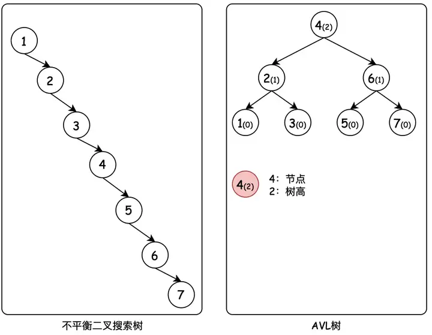

于是就有了平衡二叉树（AVL 树）。平衡二叉树通过平衡因子来限制树的解构——**任意节点的子树的高度差都小于等于 1**。将查询效率优化为了$\log _{2} n$。

AVL 树作为严格平衡的二叉树，就需要频繁的通过旋转操作来保持平衡，而旋转操作是比较耗时的，导致了维护这种高度平衡所付出的代价比从中获得的收益还大，因此只适用于插入删除次数较少，但是查找多的情况。

在上面的大背景下，诞生了红黑树，即使在最坏的情况下，也可以在$ \log \_{2} n$时间内实现插入/删除/查找操作。

红黑树是一个弱平衡二叉树，相比于严格平衡的 AVL 树，每次树的结构发生改变需要调整时，所需要的转换次数更少，因此对于插入和删除操作的效率更高。

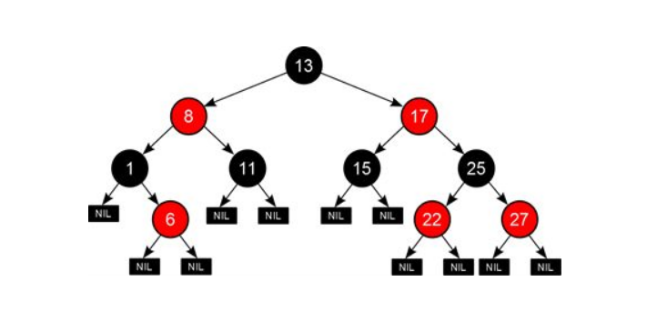

## 红黑属性的意义

为了确保红黑树的弱平衡属性，要求没有任何一条路径比其他路径长出两倍。因此在每个节点上增加了颜色属性——红或者黑。

红黑属性通过颜色规则来保持树的平衡，减少旋转操作。每次改变了树的结构（插入/删除操作）之后，最多只需要两次旋转操作即可完成树的平衡。

## 红黑树的性质

红黑树有五条性质，记住后面两条就行：

1. 每个节点非红即黑
2. 根节点是黑的
3. 每个叶节点（树尾端 NULL 节点）都是黑的
4. 如果一个节点是红的,那么它的两儿子都是黑的[^注释1]
5. 任意节点到每个叶子节点的所有路径都包含相同数目的黑节点

## 节点的定义

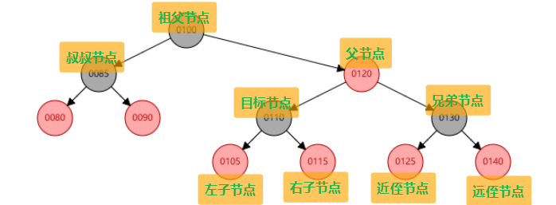

## 红黑树的着色和旋转

在插入/删除节点的时候，会破坏红黑树的性质，因此需要调整红黑树的结构，以满足上述性质。总共包含三种调整的操作——着色/左旋/右旋。

着色指的是将红色节点变为黑色节点，或者黑色节点变为红色节点。

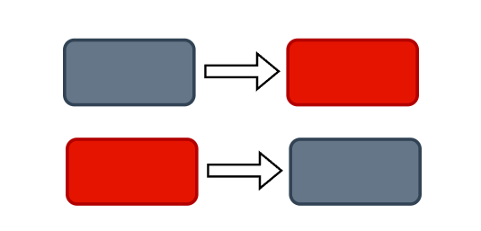

左旋操作如下所示：

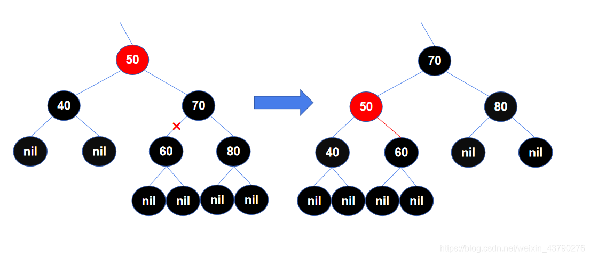

右旋操作如下所示：

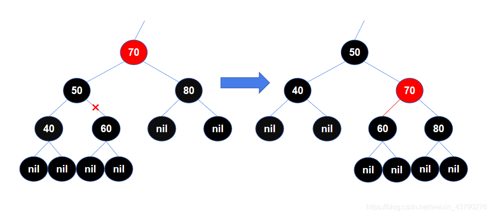

## 红黑树中的红黑属性并非唯一

红黑树的颜色属性情况并非只有唯一解，只要保证满足红黑树性质即可。如下所示，在插入 101 后删除 101，红黑树还是原来的红黑树，但是颜色属性变化了。

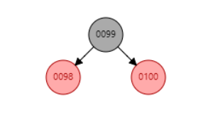
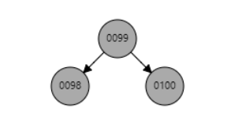

## 红黑树的插入操作

> 这里有一个规则，新插入的节点一定是红色的。因为红色节点可能不会影响平衡[^注释2]，但是黑色节点一定会影响树的平衡[^注释3]。默认插入红色节点可以减少后续操作。

红黑树的插入操作分为四种情况：

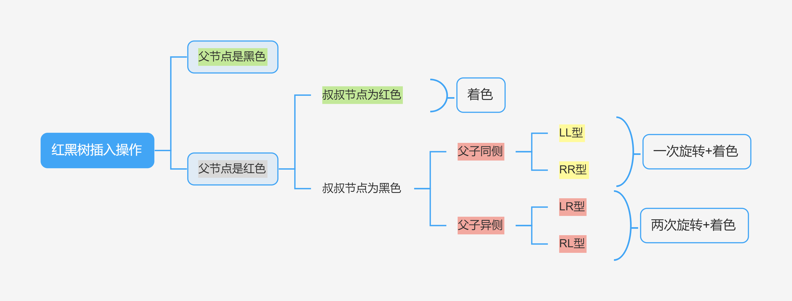

> 🦪**以下的「父节点」「叔叔节点」「祖父节点」都是插入新节点后，调整树结构前的状态（图 2 中）**

### 父节点为黑

> 🧋 直接插入新元素，不需要调整树的结构。

### 父节点为红色，叔叔节点为红色

> 🧋「父节点」和「叔叔节点」变黑，「祖父节点」变红，递归检查祖父节点是否引发新的冲突。

如图 1，插入节点 120。父节点是 110，叔叔节点是 90，符合该情况。因此将父节点 110 和叔叔节点 90 变黑，祖父节点 100 变红。引发性质 2 冲突，因此将祖父节点 100 变黑。

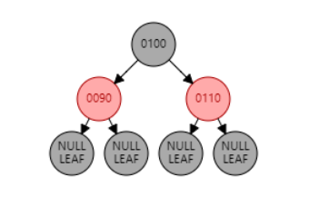
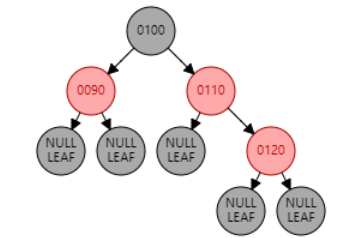
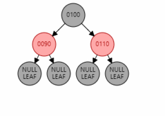

### 父节点为红色，叔叔节点为黑色，且父子同侧（LL/RR 型）

> 🧋**左左型（LL）**：右旋「祖父节点」。「父节点」变黑，「祖父节点」变红。
>
> 🧋**右右型（RR）**：左旋「祖父节点」。「父节点」变黑，「祖父节点」变红。

`例1：`插入节点 70。父节点 80 为红色，叔叔节点 null 为黑色，且父节点 80 和目标节点 70 都是左子节点，为 LL 型。因此对祖父节点 90 进行右旋。父节点 80 变黑，祖父节点 90 变红。

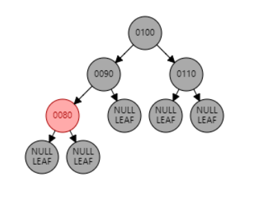
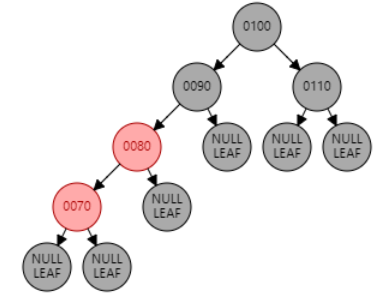
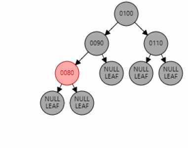

`例2：`插入节点 97。父节点 95 为红色，叔叔节点 null 为黑色，且父节点 95 和目标节点 97 都是右子节点，为 RR 型。因此对祖父节点 90 进行右旋。父节点 95 变黑，祖父节点 90 变红。

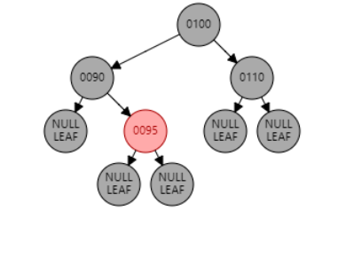
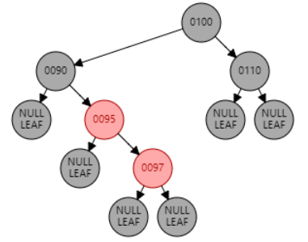

### 父节点为红色，叔叔节点为黑色，且父子异侧（LR/RL 型）

> 🧋**左右型（LR）**：先左旋「父节点」，再右旋「祖父节点」。「目标节点」变黑，「祖父节点」变红[^注释4]。
>
> 🧋**右左型（RL）**：先右旋「父节点」，再左旋「祖父节点」。「目标节点」变黑，「祖父节点」变红[^注释5]。

`例1：`插入节点 85。父节点 80 为红色，叔叔节点 null 为黑色，且父节点 80 是左子节点，目标节点 85 是右子节点，为 LR 型。因此先对父节点 80 进行左旋，再对祖父节点 90 进行右旋。目标节点 85 变黑，祖父节点 90 变红。

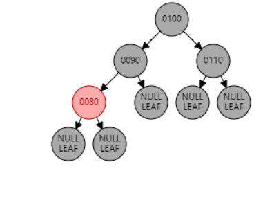
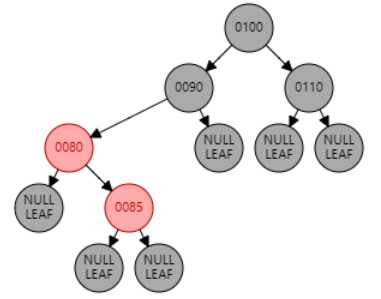

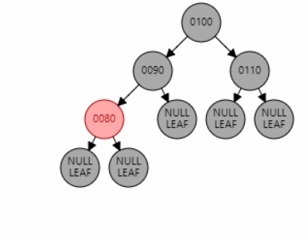
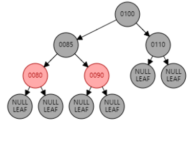

`例2：`插入节点 92。父节点 95 为红色，叔叔节点 null 为黑色，且父节点 95 是右子节点，目标节点 92 是左子节点，为 RL 型。因此先对父节点 95 进行右旋，再对祖父节点 90 进行左旋。目标节点 92 变黑，祖父节点 90 变红。

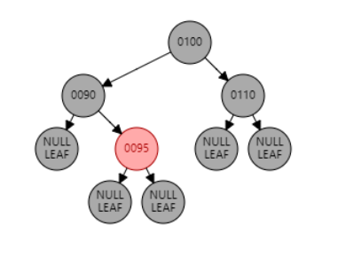
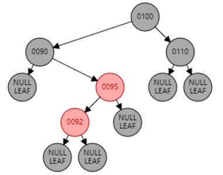

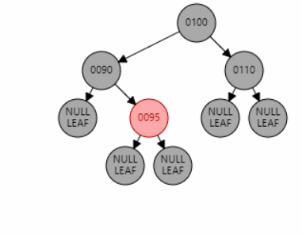
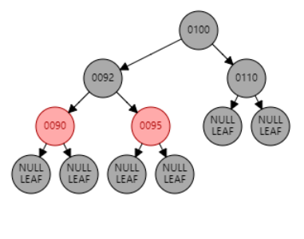

## 红黑树的删除操作

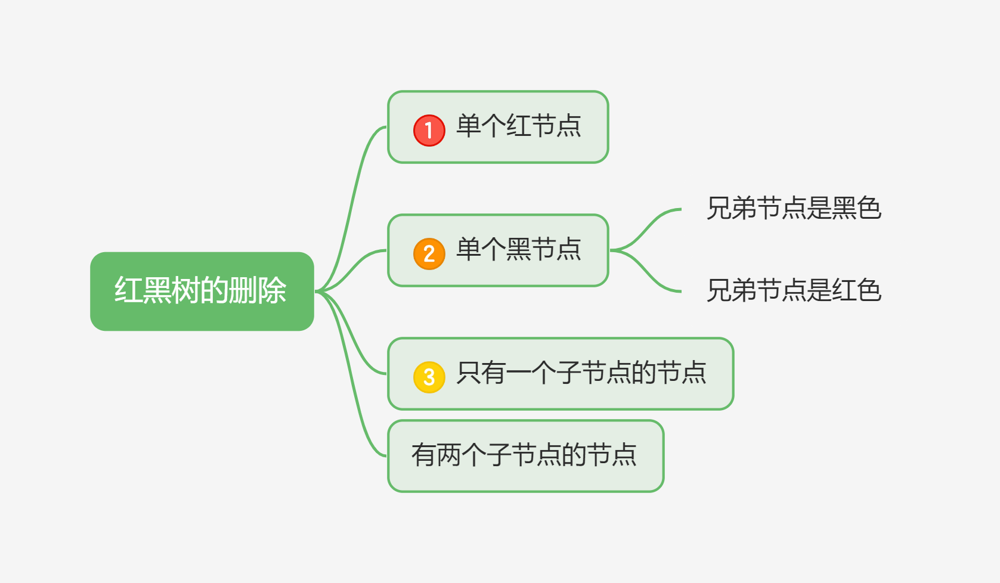

> 🧋「当前节点」指的是删除了「目标节点」后，替换了「目标节点」位置的节点。

### 删除单个红节点

> 🧋 单个红节点指的是左右子节点都是 null 的节点。不会影响红黑树的性质，因此可以直接删除。

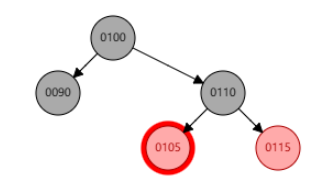
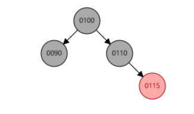

### **删除单个黑节点**

> 🧋 单个黑节点指得是左右子节点都是 null 的节点。
>
> 1. **兄弟节点是黑色，且远侄节点为红**：旋转父节点，兄弟节点颜色变为父节点的颜色，父节点和远侄节点变黑。
> 2. **兄弟节点是黑色，近侄节点为红，远侄节点为黑**：旋转兄弟节点，近侄节点变黑，兄弟节点变红。转换为兄弟节点为黑，远侄节点为红。
> 3. **兄弟节点为黑，且侄节点全黑**：兄弟节点变红，将问题上移至父节点，递归处理。
> 4. **兄弟节点为红**：旋转父节点，兄弟节点变黑，父节点变红，转换成兄弟节点为黑的情况。

`例1：`删除节点 70。兄弟节点 100 是黑色，近侄节点 90 是红色，远侄节点 null 是黑色，为情况 2。删除节点 70 后，使用 null 节点代替，作为当前节点。

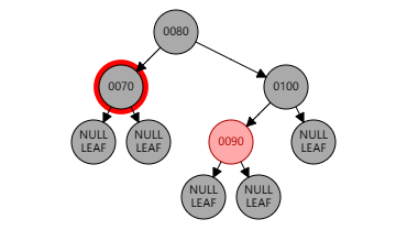
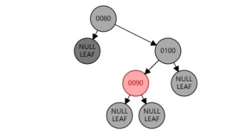

兄弟节点 100 右旋，近侄节点 90 变黑，兄弟节点 100 变红。

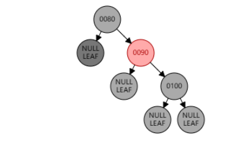
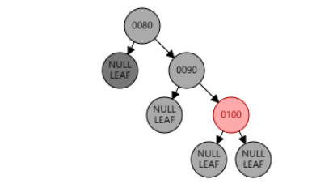

此时并没有调整完成，以 null 节点为目标节点，转换成兄弟节点 90 为黑，远侄节点 100 为红的情况。左旋父节点 80，兄弟节点 90 颜色变为父节点 80 的颜色（此处为黑色），父节点 80 和远侄节点 100 变黑。

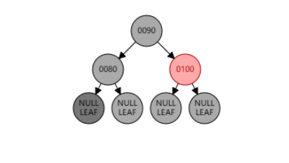
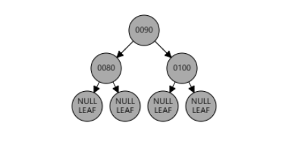

`例2：`删除节点 120。兄弟节点是红色，为情况 4。删除节点 120 后，使用 null 节点代替，作为当前节点。

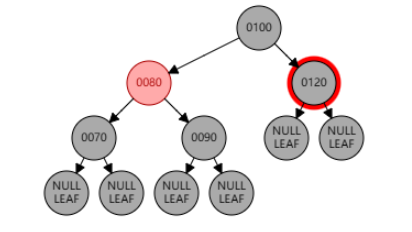
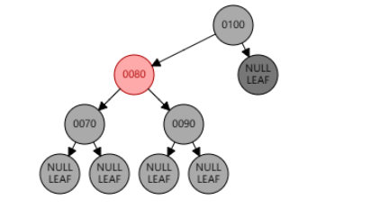

右旋父节点 100，兄弟节点 80 变黑，父节点 100 变红。

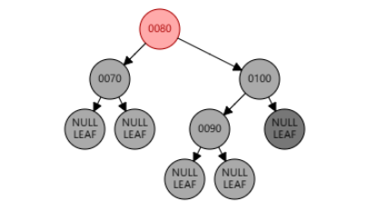
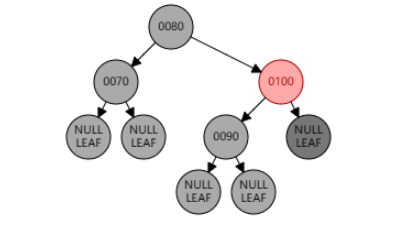

此时并没有调整完成，以 null 节点为目标节点，转换成兄弟节点 90 为黑，侄节点全黑的情况。兄弟节点 90 变红，并递归检查。

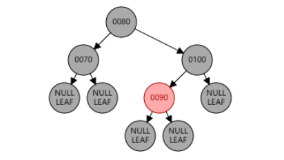

### 删除只包含一个子节点的黑色节点，该节点只可能是红色节点

只包含一个子节点时，这是唯一情况。目标节点为红色或者子节点为黑色，都会破坏红黑树的性质。

> 🧋 目标节点替换为红色子节点，且子节点变为黑色。

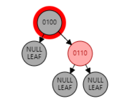
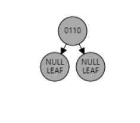

### 删除包含两个子节点的节点（不论红黑）

> 🧋 使用「左子树的最右节点[^注释6]」代替该节点，颜色保持一致，仅替换内容。然后删除最右节点（跳转其他情况）。

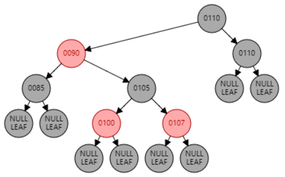
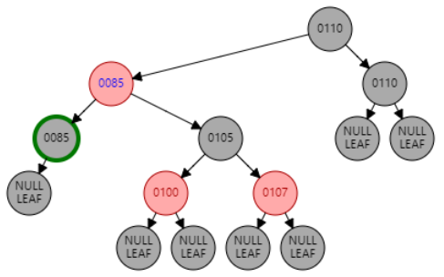

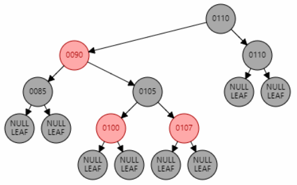
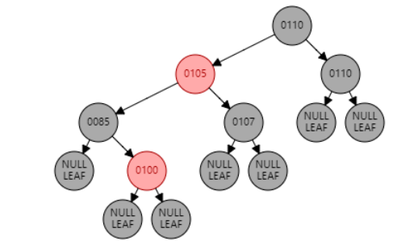

---

[红黑树的原理 (插入+ 删除) 案例分析](https://zhuanlan.zhihu.com/p/166319823 "红黑树的原理 (插入+ 删除) 案例分析")

[红黑树可视化网站](https://www.cs.usfca.edu/~galles/visualization/RedBlack.html "红黑树可视化网站")

[^注释1]: 红色节点不会连续出现
[^注释2]: 可能违反违反性质 4
[^注释3]: 可能违反性质 4，一定违反性质 5
[^注释4]: 左旋「父节点」之后，已经转化成了 LL 型的情况。
[^注释5]: 右旋「父节点」之后，已经转化成了 RR 型的情况。
[^注释6]: 也可以右子树的最左节点
