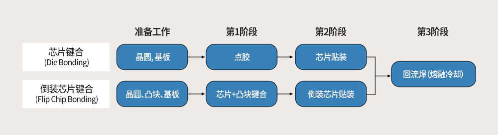
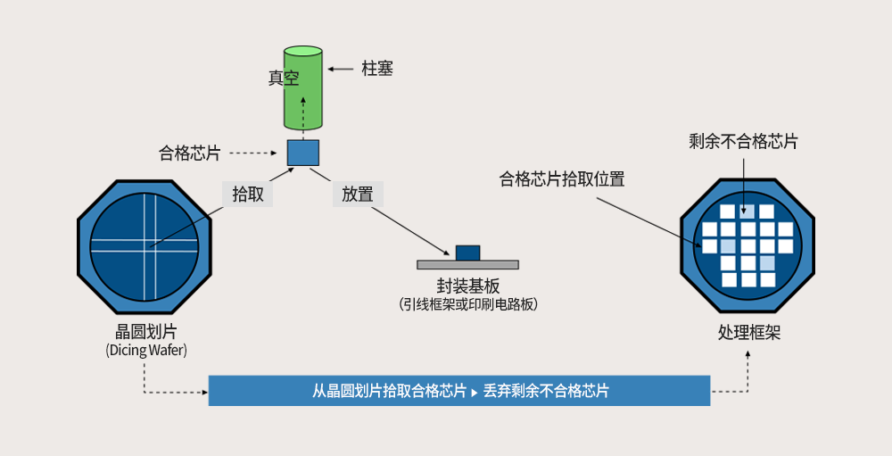
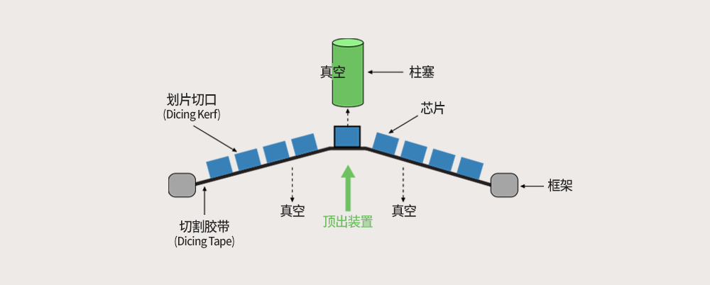

# 芯片键合（Die Bond）

> 参考：[https://blog.csdn.net/qq_46675545/article/details/128050411?spm=1001.2014.3001.5502](https://blog.csdn.net/qq_46675545/article/details/128050411?spm=1001.2014.3001.5502)

> 🦪**芯片键合**工艺在划片工艺之后将从晶圆上切割的芯片黏贴在封装基板（引线框架或印刷电路板）上，**来实现芯片与外部之间的电连接**。

键合工艺可分为传统方法和先进方法两种类型。传统方法采用芯片键合`Die Bonding`和引线键合`Wire Bonding`，而先进方法则采用 IBM 于 60 年代后期开发的倒装芯片键合`Flip Chip Bonding`技术。倒装芯片键合技术将芯片键合与引线键合相结合，并通过在芯片焊盘上形成凸块`Bump`的方式将芯片和基板连接起来。

#### 芯片拾取与放置`Pick & Place`

逐个移除附着在切割胶带上数百个芯片的过程称为“拾取`Pick`”。使用柱塞从晶圆上拾取合格芯片并将其放置在封装基板表面的过程称为“放置`Place`”。这两项任务合称为“拾取与放置`Pick&Place`”，均在固晶机（用于芯片键合的装置）上完成。完成对所有合格芯片的芯片键合之后，未移除的不合格芯片将留在切割胶带上，并在框架回收时全部丢弃。在这个过程中，将通过在映射表（`Mapping`图）中输入晶圆测试结果（合格/不合格）的方式对合格芯片进行分类。

