## 3D设计软件 FreeCAD

https://github.com/FreeCAD/FreeCAD

日常工作需要审核机械设计师在 `Solidworks` 中绘制的 3D 图纸，于是就下了这个开源软件。该软件还支持 3D 设计，但是我没有这种需求。

让我同事在 `Solidworks` 中导出 `Step` 文件，再在 `FreeCAD` 中打开即可。第一次打开 `step` 时要设置文本编码方式，选择 `GBK`，否则 `step` 文件中的中文会乱码。

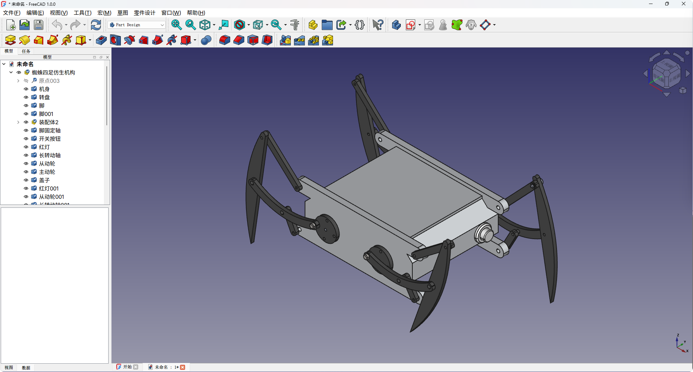

## 远程桌面 1Remote

https://github.com/1Remote/1Remote

开源软件，该软件可以记录多个远程桌面的配置（IP地址+用户+密码），下次使用双击打开即可。

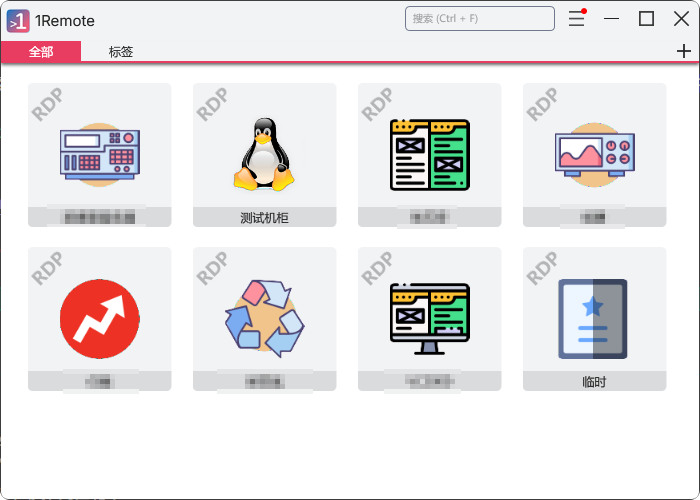

## RSS阅读 Follow

https://github.com/RSSNext/follow

开源软件，可以使用RSS订阅很多网站，这样每天只要打开 Follow 就可以看到很多网站的更新。另外还有一点好处是可以看到其他用户订阅的内容，这样可以扩展自己的知识面。

这个软件的功能是受限的，想解锁需要激活码，我是问别人要的。

## 笔记软件 Wolai

https://www.wolai.com/

国内仿 Notion 比较好的软件，挺好用，需要按年开会员，否则功能受限。

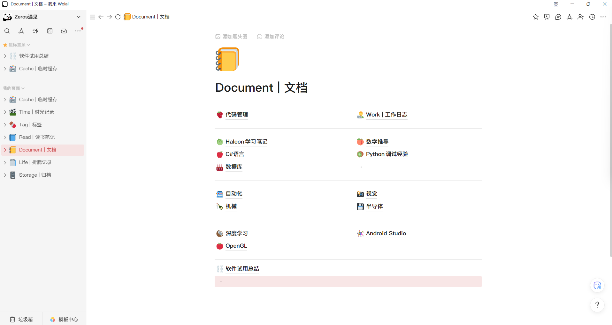

## 输入法中英文提示软件 InputTip

https://github.com/abgox/InputTip

写代码的时候需要频繁切换中英文，老是忘记看右下角，有了这个软件之后在输入的地方就会有一个悬浮图标指示大写/中文/英文。

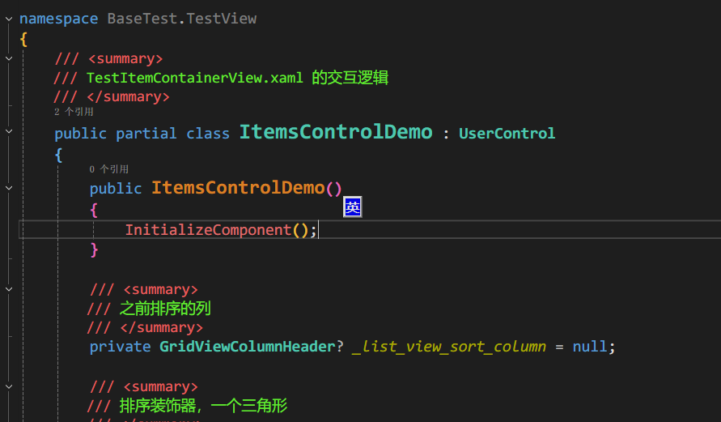

## 截图软件 PixPin

https://pixpin.cn/

贼好用的截图软件，完全覆盖了 Snipaste 的功能，除此以外可以离线OCR，长截图，录制Gif，功能很多。

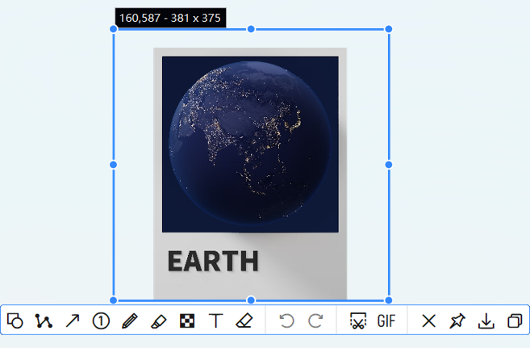

## 文件同步软件 坚果云

https://www.jianguoyun.com/

可以无感同步文件，在不同的电脑上访问，我用的是免费的 1G 空间，同步一些日常用的文件。

## 数据库管理软件 Heidi SQL

https://www.heidisql.com/

开源的数据库管理软件，支持很多类型的连接。

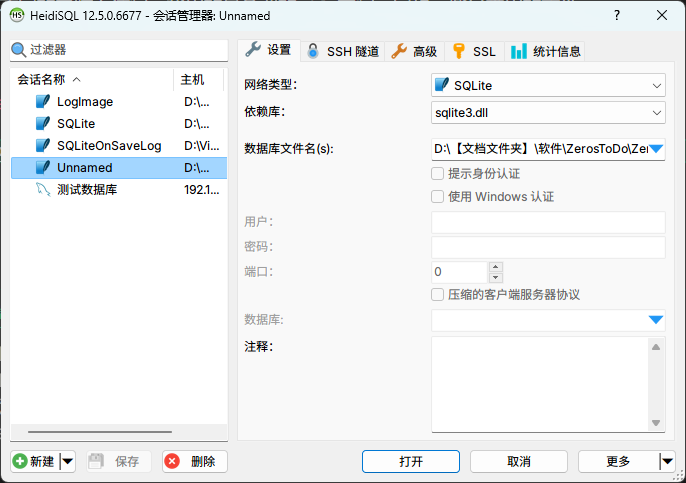

## 视频播放器 PotPlayer

http://www.potplayercn.com/

贼好用的视频播放器，功能很多，比如倍速播放，看直播源等等。

## Markdown编辑器 Typora

好用的 Markdown 编辑器，比其他的编辑器都好用，主要是很方便预览。

https://typora.io/

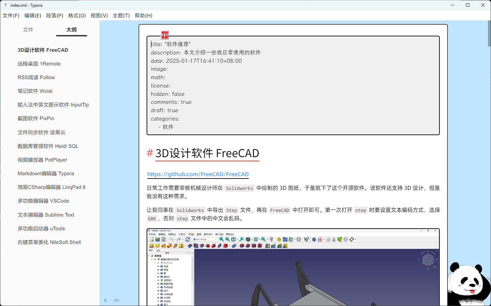

## 简易CSharp编辑器 LinqPad 8

https://www.linqpad.net/

很方便的 C# 编辑器，使用 BenchMark 特别方便，跟写 Python 一样。

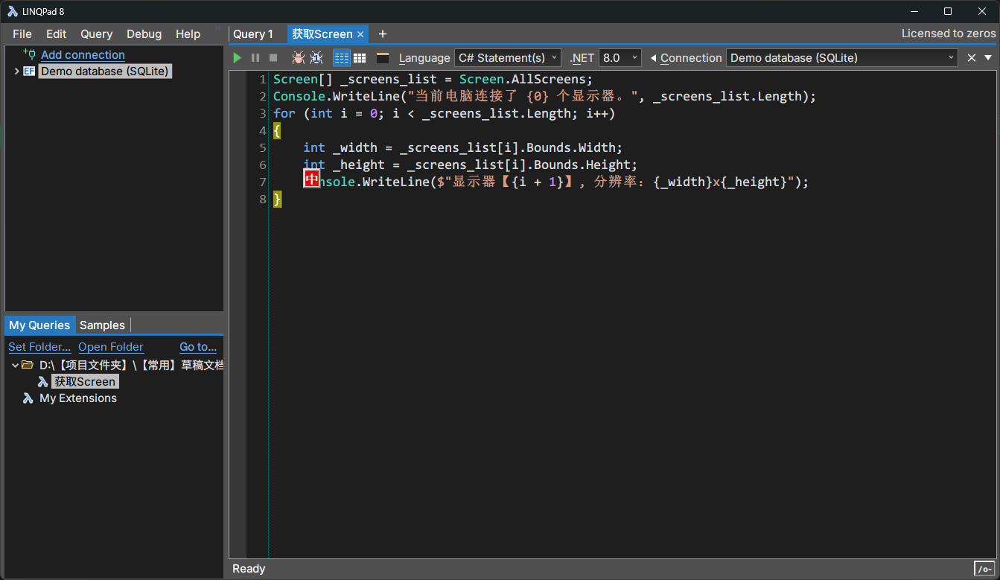

## 多功能编辑器 VSCode

https://code.visualstudio.com/

支持的文件很多，比如装插件可以看 SQL.db 文件，可以看 Excel 文件，算是高级文本编辑器。

还可以使用 Polyglot NoteBook 写 C#，跟 Jupyter NoteBook 类似，但是会有一些限制，而且代码提示没有 LinqPad 8 好用。

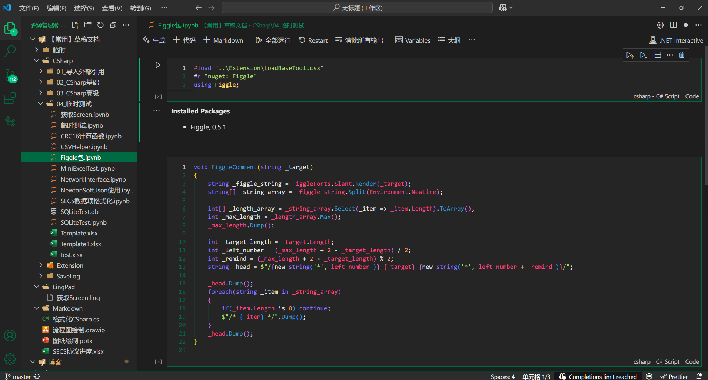

## 文本编辑器 Notpad--

https://gitee.com/cxasm/notepad--

选择这个文本编辑器有几点原因：

1. 操作逻辑和VS2022相同
2. 不用折腾
3. 支持多标签

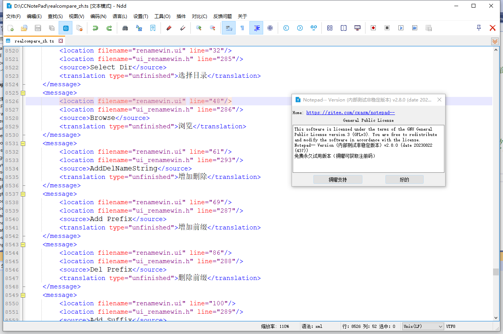

## 多功能启动器 uTools

https://www.u.tools/

神。

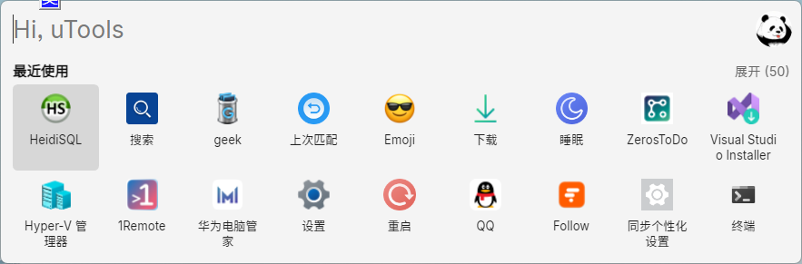

## 右键菜单美化 NileSoft Shell

https://nilesoft.org/

升级 Windows 11 后右键菜单不是很好用，所以下了这个软件，给右键菜单新增了额外的功能，并且颜值很高。

> 这个软件有个问题，`发送到`这个菜单显示空白，我两台电脑都有这个问题，但是我在网上没搜到相同的问题。

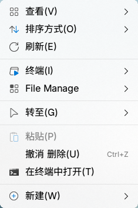

## 快速预览 QuickLook

https://github.com/QL-Win/QuickLook

跟 `MacOS` 一样的按空格预览文件的功能。需要额外下载插件，我下载了DrawIO，Office预览。

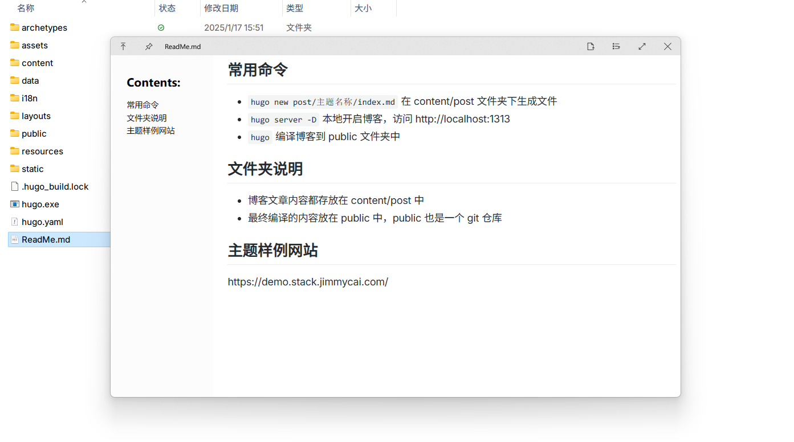
